# 《黑神话悟空》全探索图文攻略 支线+隐藏+重要收集路线讲解

*来源: [https://www.gamersky.com/handbook/202408/1803231.shtml](https://www.gamersky.com/handbook/202408/1803231.shtml)*

## 目录

- [第1页：第一回-苍狼林-前山](#第1页：第一回-苍狼林-前山)
- [第2页：第一回-苍狼林-林外](#第2页：第一回-苍狼林-林外)
- [第3页：第一回-苍狼林-观音禅院](#第3页：第一回-苍狼林-观音禅院)
- [第4页：第一回-翠竹林-后山](#第4页：第一回-翠竹林-后山)
- [第5页：第一回-翠竹林-蛇径](#第5页：第一回-翠竹林-蛇径)
- [第6页：第一回-翠竹林-白雾泽](#第6页：第一回-翠竹林-白雾泽)
- [第7页：第一回-隐·旧观音禅院](#第7页：第一回-隐·旧观音禅院)
- [第8页：第一回-黑风洞-洞内](#第8页：第一回-黑风洞-洞内)
- [第9页：第一回-黑风洞-洞外](#第9页：第一回-黑风洞-洞外)
- [第10页：第一回-黑风洞-见谛峰](#第10页：第一回-黑风洞-见谛峰)
- [第11页：第二回-沙门村-村口](#第11页：第二回-沙门村-村口)
- [第12页：第二回-沙门村-村内](#第12页：第二回-沙门村-村内)
- [第13页：第二回-沙门村-不济谷](#第13页：第二回-沙门村-不济谷)
- [第14页：第二回-挟魂崖-藏风山凹（1）](#第14页：第二回-挟魂崖-藏风山凹（1）)
- [第15页：第二回-挟魂崖-藏风山凹（2）](#第15页：第二回-挟魂崖-藏风山凹（2）)
- [第16页：第二回-挟魂崖-枕石坪](#第16页：第二回-挟魂崖-枕石坪)
- [第17页：第二回-挟魂崖-碎石台](#第17页：第二回-挟魂崖-碎石台)
- [第18页：第二回-黄风阵-镇风门](#第18页：第二回-黄风阵-镇风门)
- [第19页：第二回-卧虎寺-寺门](#第19页：第二回-卧虎寺-寺门)
- [第20页：第二回-隐·斯哈里国](#第20页：第二回-隐·斯哈里国)
- [第21页：前两回隐藏龙](#第21页：前两回隐藏龙)
- [第22页：第二回-卧虎寺-地窖](#第22页：第二回-卧虎寺-地窖)
- [第23页：第二回-黄风阵-定风桥](#第23页：第二回-黄风阵-定风桥)
- [第24页：第二回-黄风阵-定风庄](#第24页：第二回-黄风阵-定风庄)
- [第25页：第二回-黄风阵-黄风大圣](#第25页：第二回-黄风阵-黄风大圣)
- [第26页：第三回-雪山径-披霜道](#第26页：第三回-雪山径-披霜道)
- [第27页：第三回-雪山径-照鉴湖](#第27页：第三回-雪山径-照鉴湖)
- [第28页：第三回-浮屠界-下层](#第28页：第三回-浮屠界-下层)
- [第29页：第三回-浮屠界-上层](#第29页：第三回-浮屠界-上层)
- [第30页：第三回-浮屠界-轮藏](#第30页：第三回-浮屠界-轮藏)
- [第31页：第三回-浮屠界-经筒外](#第31页：第三回-浮屠界-经筒外)
- [第32页：第三回-浮屠界-冲寒道、浮屠塔](#第32页：第三回-浮屠界-冲寒道、浮屠塔)
- [第33页：第三回-浮屠界-安身寺](#第33页：第三回-浮屠界-安身寺)
- [第34页：第三回-苦海-龟岛](#第34页：第三回-苦海-龟岛)
- [第35页：第三回-苦海-苦海北岸](#第35页：第三回-苦海-苦海北岸)
- [第36页：如意画轴](#第36页：如意画轴)
- [第37页：第三回-苦海-戒语廊](#第37页：第三回-苦海-戒语廊)
- [第38页：第三回-极乐谷-一念壁](#第38页：第三回-极乐谷-一念壁)
- [第39页：第三回-极乐谷-快活林](#第39页：第三回-极乐谷-快活林)
- [第40页：第三回-极乐谷-罪业塔林](#第40页：第三回-极乐谷-罪业塔林)
- [第41页：第三回-极乐谷-无忧涧](#第41页：第三回-极乐谷-无忧涧)
- [第42页：第三回-极乐谷-长生大道](#第42页：第三回-极乐谷-长生大道)
- [第43页：第三回-小雷音寺-寺门](#第43页：第三回-小雷音寺-寺门)
- [第44页：第三回-小雷音寺-大殿](#第44页：第三回-小雷音寺-大殿)
- [第45页：第四回-兰喜村-朱家大院](#第45页：第四回-兰喜村-朱家大院)
- [第46页：第四回-盘丝洞-上层](#第46页：第四回-盘丝洞-上层)
- [第47页：第四回-盘丝洞-碎玉池](#第47页：第四回-盘丝洞-碎玉池)
- [第48页：第四回-盘丝洞-花间桥](#第48页：第四回-盘丝洞-花间桥)
- [第49页：第四回-盘丝洞-中层](#第49页：第四回-盘丝洞-中层)
- [第50页：第四回-盘丝洞-千红窟](#第50页：第四回-盘丝洞-千红窟)
- [第51页：第四回-盘丝洞-绝想崖](#第51页：第四回-盘丝洞-绝想崖)
- [第52页：第四回-盘丝洞-堕龙壁](#第52页：第四回-盘丝洞-堕龙壁)
- [第53页：第四回-盘丝洞-底层](#第53页：第四回-盘丝洞-底层)
- [第54页：第四回-盘丝洞-若仙庵](#第54页：第四回-盘丝洞-若仙庵)
- [第55页：第四回-盘丝洞-濯垢泉](#第55页：第四回-盘丝洞-濯垢泉)
- [第56页：第四回-盘丝洞-万慈窟](#第56页：第四回-盘丝洞-万慈窟)
- [第57页：第四回-黄花观-山道](#第57页：第四回-黄花观-山道)
- [第58页：第四回-黄花观-虎蛇虫林](#第58页：第四回-黄花观-虎蛇虫林)
- [第59页：第四回-黄花观-观门](#第59页：第四回-黄花观-观门)
- [第60页：第四回-隐·紫云山-千花谷、绕仙居](#第60页：第四回-隐·紫云山-千花谷、绕仙居)
- [第61页：第四回-隐·紫云山-落花庄](#第61页：第四回-隐·紫云山-落花庄)
- [第62页：第四回-隐·紫云山-巢云顶](#第62页：第四回-隐·紫云山-巢云顶)
- [第63页：第四回-黄花观-金光苑](#第63页：第四回-黄花观-金光苑)
- [第64页：第五回-灰烬林-火燎一关](#第64页：第五回-灰烬林-火燎一关)
- [第65页：第五回-灰烬林-春秋寨](#第65页：第五回-灰烬林-春秋寨)
- [第66页：第五回-灰烬林-灰烬台](#第66页：第五回-灰烬林-灰烬台)
- [第67页：第五回-灰烬林-火燎二关](#第67页：第五回-灰烬林-火燎二关)
- [第68页：第五回-丹灶谷-谷口](#第68页：第五回-丹灶谷-谷口)
- [第69页：第五回-丹灶谷-罗刹宫](#第69页：第五回-丹灶谷-罗刹宫)
- [第70页：第五回-丹灶谷-翠云殿](#第70页：第五回-丹灶谷-翠云殿)
- [第71页：第五回-火光地-火燎三关](#第71页：第五回-火光地-火燎三关)
- [第72页：第五回-火光地-清凉坡](#第72页：第五回-火光地-清凉坡)
- [第73页：第五回-隐·璧水洞-炼魔坑](#第73页：第五回-隐·璧水洞-炼魔坑)
- [第74页：第五回-隐·璧水洞-洞天深处](#第74页：第五回-隐·璧水洞-洞天深处)
- [第75页：第五回-隐·璧水洞-水火道](#第75页：第五回-隐·璧水洞-水火道)
- [第76页：第五回-火光地-陨砖坑](#第76页：第五回-火光地-陨砖坑)
- [第77页：第六回-山脚-青嶂道](#第77页：第六回-山脚-青嶂道)
- [第78页：第六回-山脚-望犀坡](#第78页：第六回-山脚-望犀坡)
- [第79页：第六回-山脚-见鹿林](#第79页：第六回-山脚-见鹿林)
- [第80页：第六回-山脚-捕螂汀](#第80页：第六回-山脚-捕螂汀)
- [第81页：第六回-水帘洞-峰回路](#第81页：第六回-水帘洞-峰回路)
- [第82页：第六回-水帘洞-天真顶、普通结局](#第82页：第六回-水帘洞-天真顶、普通结局)
- [第83页：隐藏结局](#第83页：隐藏结局)
- [第84页：随机掉落物](#第84页：随机掉落物)
- [第85页：二周目新内容](#第85页：二周目新内容)
- [第86页：人物剧情梳理分析（通关后一定要看）](#第86页：人物剧情梳理分析（通关后一定要看）)

---

## 第1页：第一回-苍狼林 前山

《黑神话悟空》的关卡设计相当复杂，地图中藏着各种隐藏令人惊叹，稍不注意就会错过很多，这里我来为大家制作《黑神话悟空》全探索图文攻略，对地图中隐藏的NPC支线任务、隐藏关卡、隐藏BOSS、重要收集等等内容结合主线流程进行路线规划讲解，尽量带你一遍找完少走弯路，并获得完整剧情体验。

（本文已经尽量精简，减少了剧情描述以减少剧透，但是在提到BOSS名和人名时难以避免还会有些许剧透，建议在你还没有打到的时候，先别看后面的内容。）

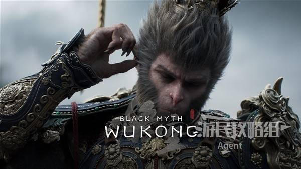

本文包括：

全部NPC位置、任务、隐藏及路线规划，带给你完整剧情体验
全部土地庙
影神图全解锁（最后两个人物需要进二周目自动解锁）
打坐蒲团（24个）
法术（18个，其中变身10种，筋斗云也算1个，1个进二周目自动获得）
金丹（16个，其中碧藕金丹5个、太乙紫金丹5个、九转金丹5个，集齐五蕴最后还有个五蕴丹）
落伽香藤（15个，其中3个申猴处买）
三冬虫（12个，其中3个申猴处买）

武器（8把，其中1把是豪华版奖励，3把有升级树且二周目才能升满）
头冠（19件，其中1件是豪华版奖励，3件是刷怪随机掉落）
衣甲（20件，其中1件是豪华版奖励）
臂甲（21件，其中1件是豪华版奖励，1件是刷怪随机掉落）
腿甲（18件，其中1件是豪华版奖励）
珍玩（37个，其中1个是豪华版奖励，10个是刷怪随机掉落）
精魄（54个）
法宝（4个）

葫芦（10个，其中1个需要进二周目，影神图全解锁后买）
酒（9个）
泡酒物（27个，其中1个需要二周目买，7个是采药材或刷怪随机掉落）
丹方（14个，其中1个需要二周目买）
种子（12个）

另外，通关后解锁的BOSS连战模式，还会奖励一些额外收集品，打通BOSS连战自然就会全部获得。游戏后续在土地庙更新的“谢礼”这里也未计入。

第一回-苍狼林 前山

序幕打二郎神，熟悉基本操作。

干掉两只小狼妖后，往前走的路上捡到药材“老山参”。注意在探索地图时多搜刮地上的各种药材，等后面合成丹药用，吃丹药对战斗会很有帮助。

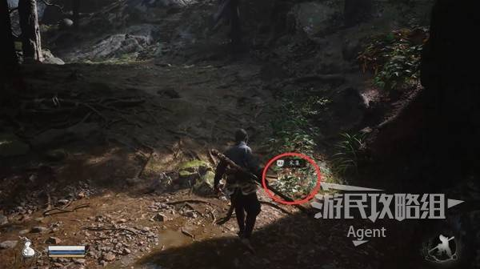

走阶梯上山，拿个宝箱。

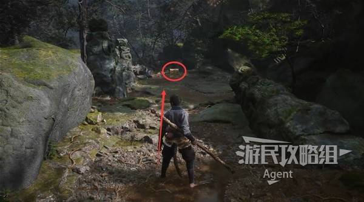

然后跟随金色光线走，它会带你找到附近的土地庙。

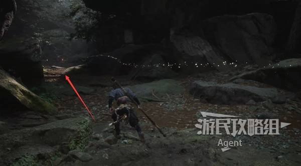

土地公公会给你第一关的地图（行旅图），在要紧物事一栏可以看到。等到了后面几关，则需要在土地庙买地图。

土地公公给你的“缩地青符”，在有需要时，可直接打开物品栏使用缩地青符返回最后拜过的土地庙。

当主角死亡后，也会自动在最后拜过的土地庙复活。

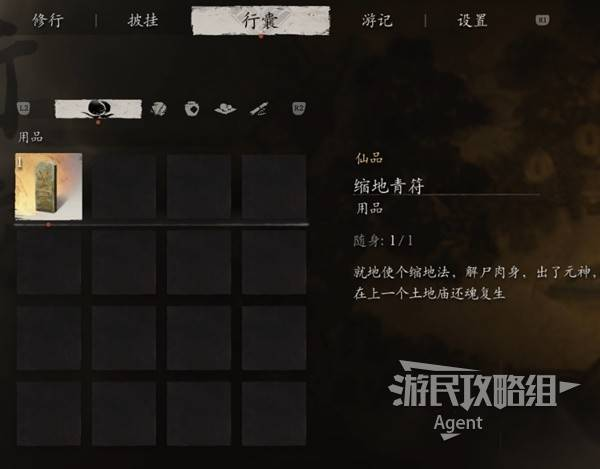

土地公公走后，在土地庙上香，查看土地庙的功能。

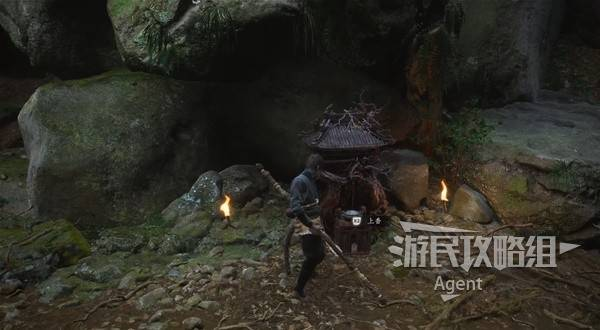

土地庙的功能会随着游戏进度逐步解锁，目前还暂时比较少。

调息：回满血、魔法、葫芦里的酒，同时妖怪们也会刷新复活。

缩地：可以传送到已解锁的土地庙。

谢礼：领取预购、豪华版奖励的装备，包括【葫芦】争先红葫芦、【武器】铜云棒、【百戏套装】、【珍玩】风铎，在游戏初期有些帮助。其中预购奖励的争先红葫芦，如果没有预购也没有关系，后面还可以获得。发售后游戏还更新了新春谢礼彩金套装。

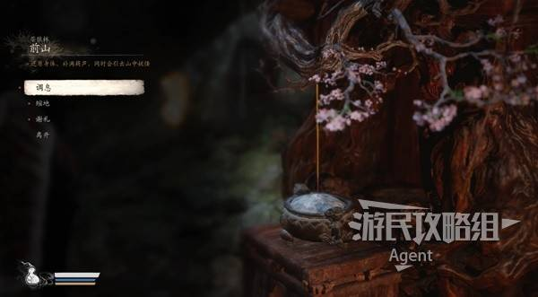

（本游戏的地图比较绕，建议小心点跟着我走，避免迷路。其实很多路都是相通的，我尽量安排好顺序，带你省心地探索完每条路。另外，遇到的妖怪建议都打死，避免遗漏妖怪图鉴、掉落物。）

往前走有座桥，过桥后会来到一片比较大的区域。

向左跳到桥下面顺着河流走，和直接过桥向前走，这两条路是相通的，等下再去。

先向右跳到桥下面到河流的源头，有灵蕴（货币）可以采集。

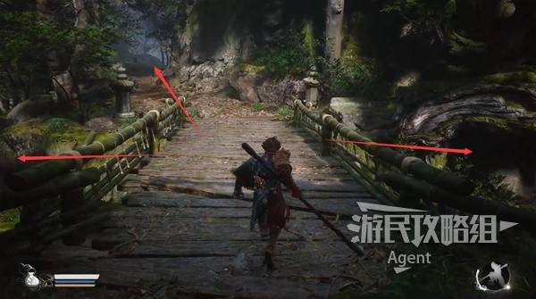

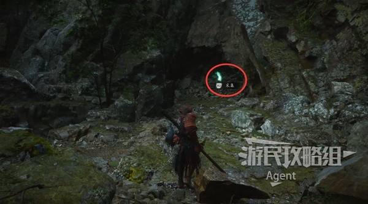

从桥下方的桥洞出发，顺着河流的方向走一点，我采碧藕时掉落了碧藕种子。药材种子等后面遇到某个人后，可以交给他种植药材，到时会讲。

（采地上的各种药材时可能会掉落种子或泡酒物，应该是有随机性的，你可能这里掉的不是种子，没关系，别处还有机会采到。打各种小怪，也有概率掉落道具，总之在地图上多搜刮总是有好处的。随机掉落的东西，第一次游玩途中并没有必要特别留意，只要你见怪就打、见草就拔，肯定可以获得很多，最后看本文末尾去补就好了。）

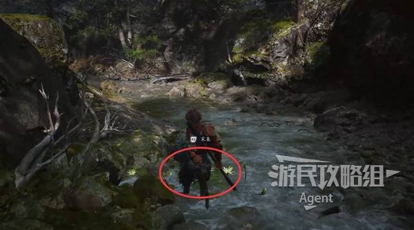

顺着河流走，遇到小青蛙妖一定要小心，它死后会爆炸放毒，一定要躲远些，不然你中毒后会持续掉血。

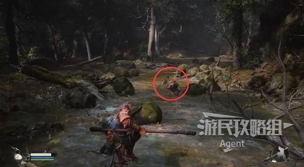

在河流的尽头，看到个鬼鬼祟祟的家伙。待它走后，过去调查佛头，得到【色蕴】。

然后去河流右侧打头目“牯护院”。

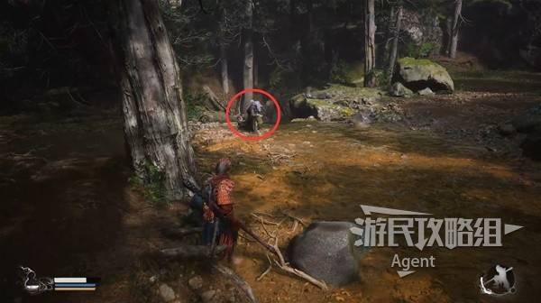

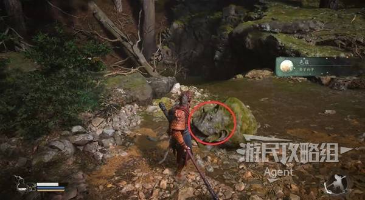

牯护院打到一半的时候，土地公公会出现教你【法术】定身法。击败牯护院后，经过门继续往前走。

牯护院详细打法

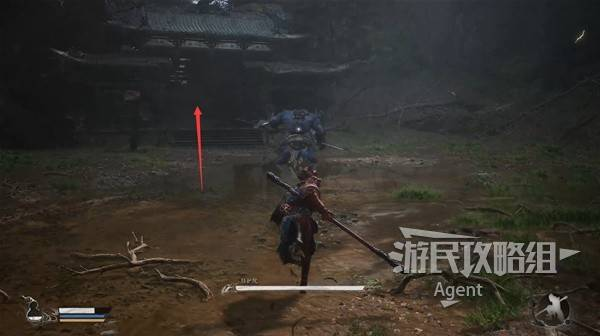

山坡右边有个小水池搜刮一下，然后走上山坡。

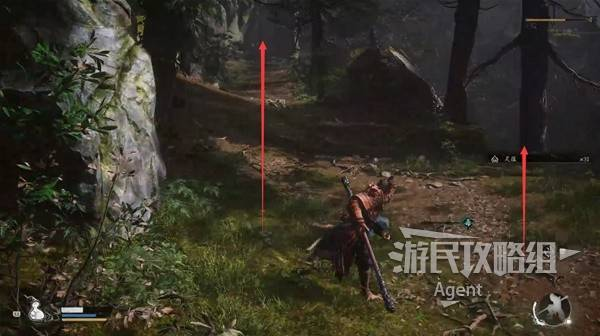

走山坡上来后，右拐有个亭子，亭子里有个【打坐蒲团】，坐上去欣赏风景可得一个技能点。

另外坛坛罐罐可以打碎，获得些许灵蕴。

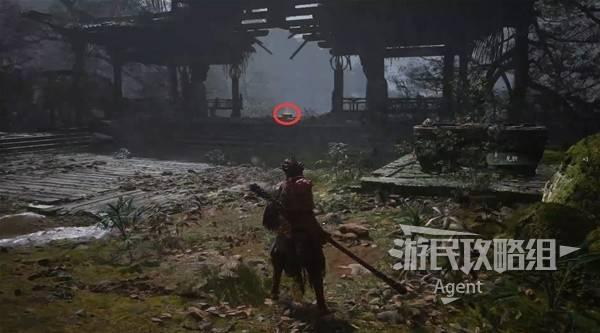

打完坐后回头看，进入山洞遇到第二个土地庙。

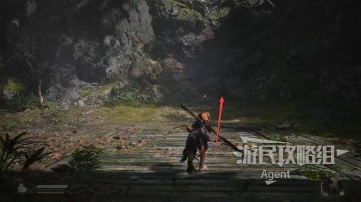

游民星空《黑神话悟空》互动地图现已上线，地图不仅囊括土地庙等地点、收集物品的点位，还标注了全部Boss、隐藏支线和重要道具的点位，照着地图走轻松全收集。

## 第2页：第一回-苍狼林 林外

第一回-苍狼林 林外

在第二个土地庙解锁了新功能。

修行-法术整备：当获得的法术技能越来越多后，在这里更换装备中的法术。

修行-天赋重修：可随时免费洗技能点。可以一下全部洗掉返还所有技能点，也可以有针对性地逐个挑选洗点。

货殖：就是商店，可以买卖物品。根据需要购买丹药、材料、药材，碎金片可以卖了换钱。

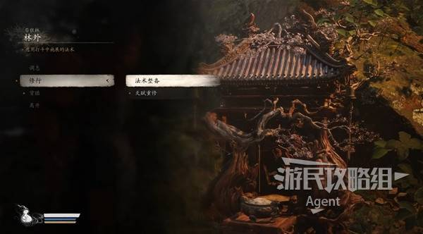

将物品栏的丹药置放到下方快捷栏中，就可以在战斗中快捷使用。有个小技巧，在战斗中可以暂停，然后在物品栏里从容不迫地吃丹药，在BOSS战等比较危急的时刻甚至可以救命。

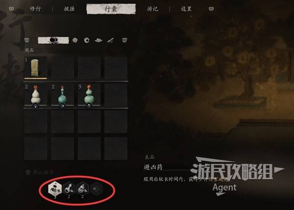

变成金蝉可以探探路，不过注意持续时间较短，其实主要还是得靠自己摸索地图。

我画的简图是以你离开土地庙时的朝向为准，如果看不懂的话，直接看游民标注的游戏官方地图：

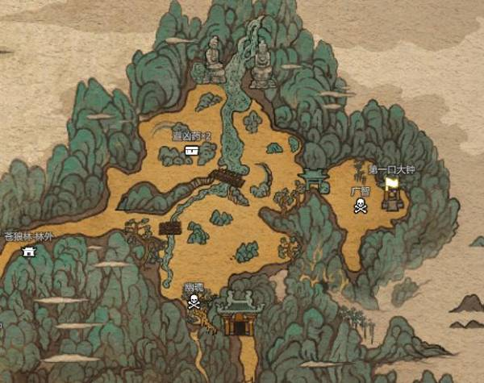

这里简略地画了下示意图（以离开土地庙时，你的朝向为准），只需认准河流和两座桥的位置，其他东西就好定位了。

从土地庙出发有个分岔路口，向前直走就是上图右边的桥，左拐走到高处就是上图左边的桥。

走过右边的桥，击败幽魂就可以直接从出口离开了，所以最后再去。先探索左边桥、瀑布、河流这一大片区域，搜刮搜刮。

左边（高处）的桥，桥头有个宝箱。桥上有个弓箭手，需用棍花抵挡弓箭射击，然后逐步靠近干掉它。

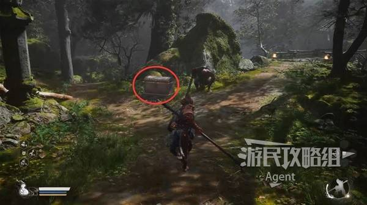

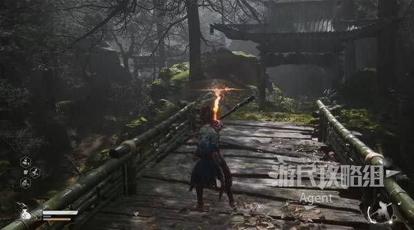

过桥后左拐，沿着路往前走，进门遇到广智和一口大钟。

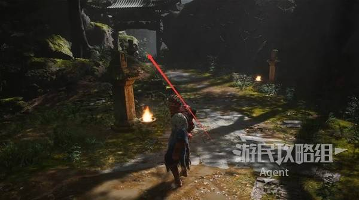

广智的攻击欲望并不强，定身术定住打一套连招后，大可以站远些等待定身术冷却恢复，然后定住再来一套连招，这样打会轻松很多。（这绝对是最简单的打法，信我，包过）

广智详细打法

击败广智后，拾取他的武器获得【法术】赤潮，战斗时可变身狼妖。

然后别忘了去敲钟，本关总共有三口大钟要敲，这关系到隐藏关卡。

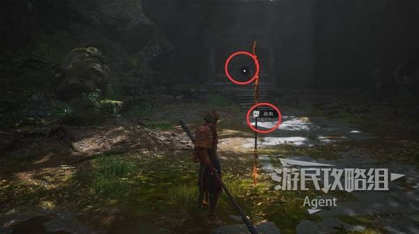

探索地图时，注意有的妖怪伪装成药材躲在地下，你去采药材时它就会爬出来。

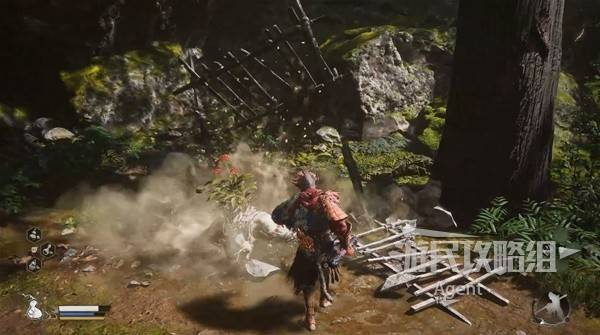

左边地图都搜刮过后，到右边桥这里打幽魂，现在可以变身狼妖战斗了。

幽魂的招都很猛，小心被秒掉。尤其是它捶地时，会连续捶地造成大量伤害，要躲远些。其实这里没有空气墙，你大可以躲到很远的地方去恢复，甚至还可以把他引到树林里卡住打。不要慌，多死几次，多练几级，自然就过了。

击败幽魂得到【珍玩】猫睛宝串，这是可以穿戴的饰品。

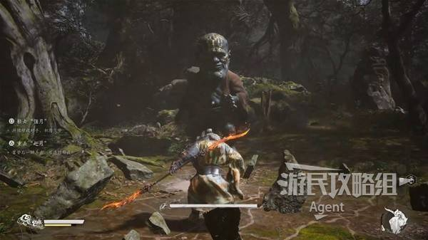

击败幽魂还会掉落紫色的精魄，但是提示“未经点化”不让你捡，先不用管，稍后自会得到答案。

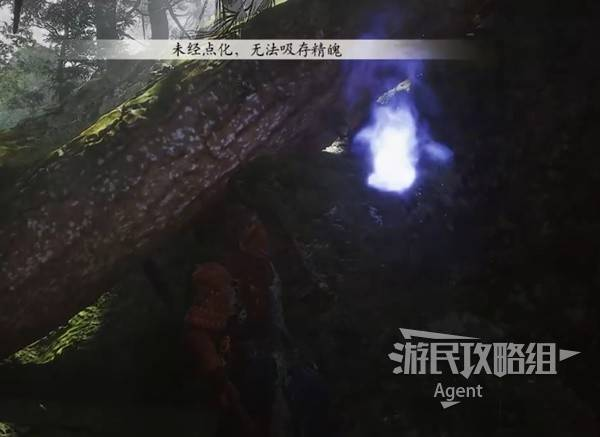

击败幽魂后从出口离开，钻过山洞走木栈道，一路前往观音禅院。

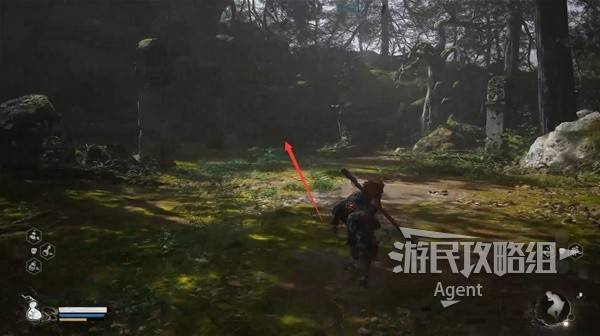

## 第3页：第一回-苍狼林 观音禅院

第一回-苍狼林 观音禅院

来到观音禅院，土地庙解锁“披挂铸造”功能，制作【行者套装】。

先搜刮下院子，左前方角落里有个宝箱，然后继续往前走打灵虚子。现在法术、变身都有了，有招就放不要舍不得，放的早还可以等恢复再放，基本每次见到BOSS一套大招放完并且都命中的话，能打掉他很多血，不要只靠普通攻击打。

灵虚子详细打法

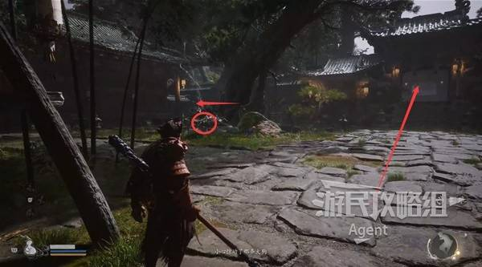

击败灵虚子得到【头冠】白脸子、【玲珑内丹】。玲珑内丹等后面遇到某个人，可以用来炼制天上仙丹。

搜刮和灵虚子战斗的这个院子，右边亭子里有个宝箱。

然后进入正前方的房子，左边开盒子得到【碧藕金丹】，直接提升生命值上限。

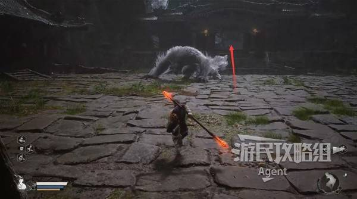

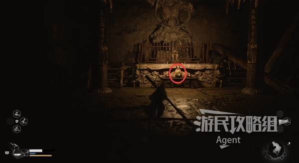

## 第4页：第一回-翠竹林 后山

第一回-翠竹林 后山

走出房子遇到土地庙。

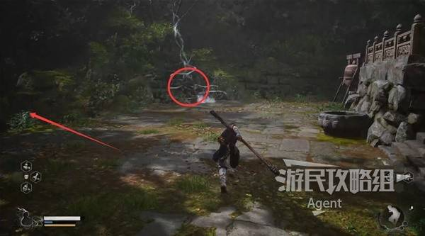

走下坡有个水池，先不往前走。

先走水池左边的小路到洞里，有个【打坐蒲团】，并遇到马哥。

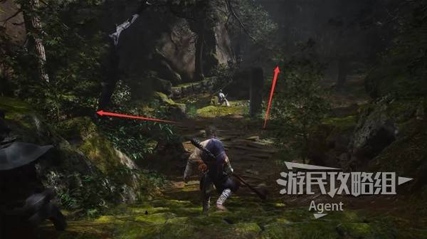

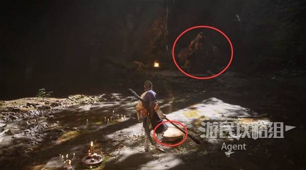

和马哥反复对话，直到对话重复为止。（注意，每个NPC都必须反复对话直到重复，不然他不会去下一个地方）

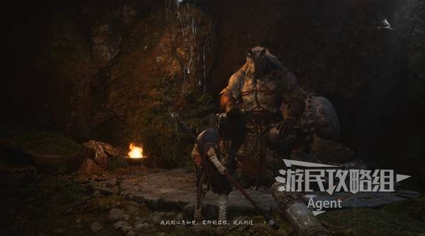

回到水池继续往前走，主道路的右侧有个棺材宝箱可以开。

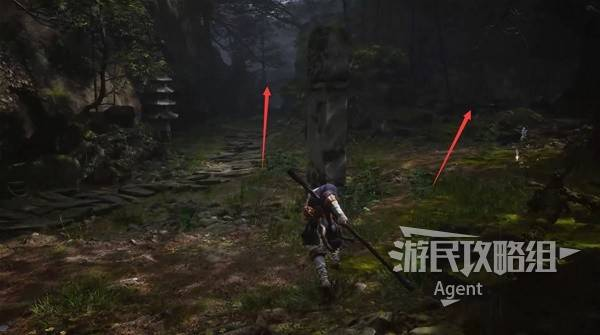

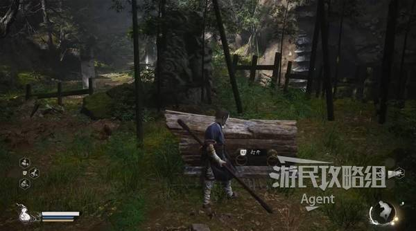

右边水池搜刮一下，然后走左边阶梯上去过桥。注意阶梯左边的小路有灵蕴捡。

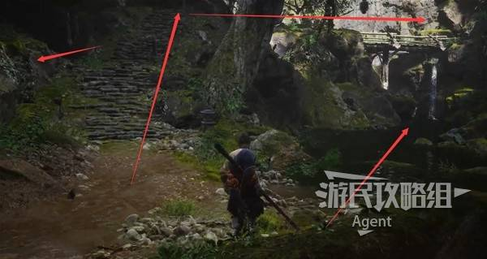

过桥后有个分岔路口，右边亭子里开盒子得到一些丹药，然后走左边遇到土地庙。

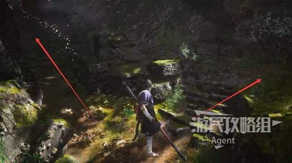

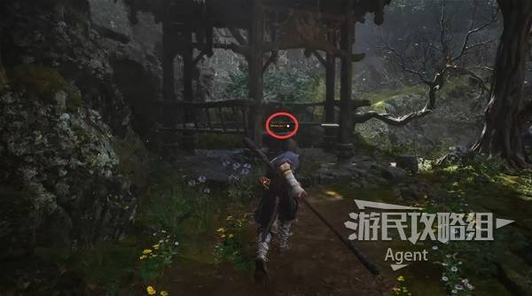

## 第5页：第一回-翠竹林 蛇径

第一回-翠竹林 蛇径

激活土地庙后，走阶梯上山。

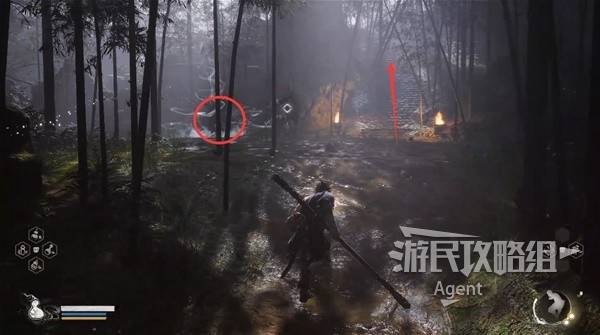

先去右边遇到葫芦仙人，然后再回来走左边过桥。

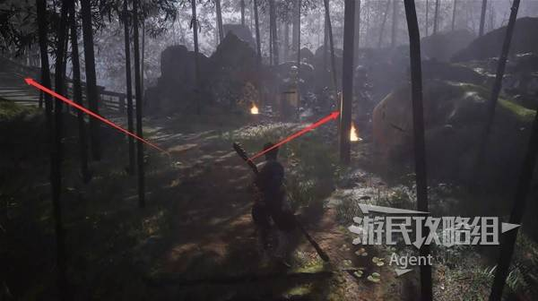

葫芦仙人会点化你的葫芦，然后就可以用葫芦吸收精魄了。和葫芦仙人反复对话直到重复为止。

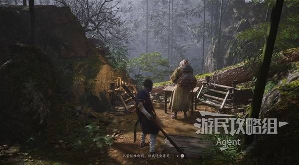

过桥后一直往前走，来到一条河边。

左拐往前走会抵达竹林，先不过去。先右拐沿着河流走遇到头目“波里个浪”，打完波里个浪继续往前走，也能抵达竹林。

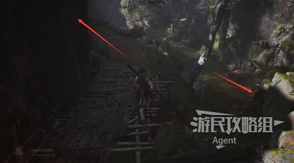

波里个浪详细打法

击败波里个浪，吸收到它的紫色【精魄】波里个浪。

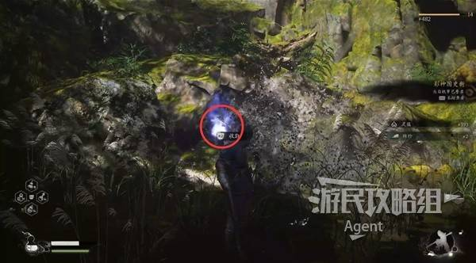

装备精魄可使用化身技，战斗时显示在屏幕右下角。

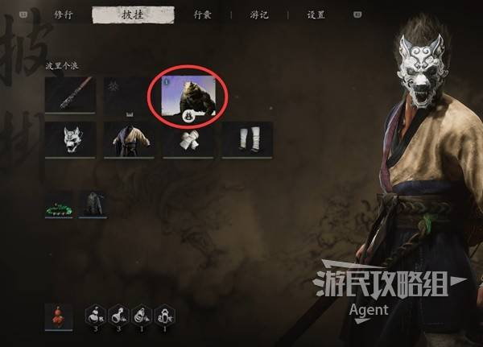

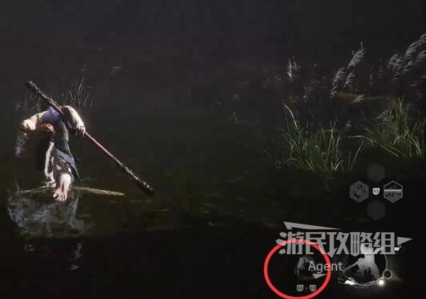

在土地庙的“修行-炼精”，可使用材料升级强化精魄。

点击“拾遗”可取回之前没捡的【精魄】幽魂。

来到竹林，竹林里有不少妖怪，搜刮一下竹林，然后沿着石头小路继续往前走，遇到广谋。

广谋详细打法

击败广谋，得到【精魄】广谋。

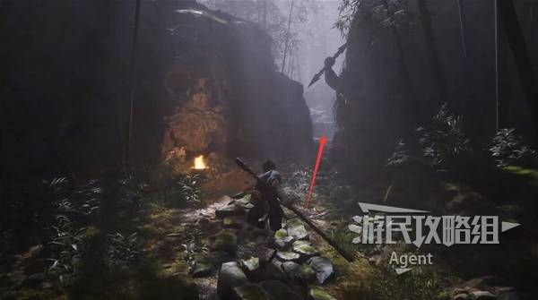

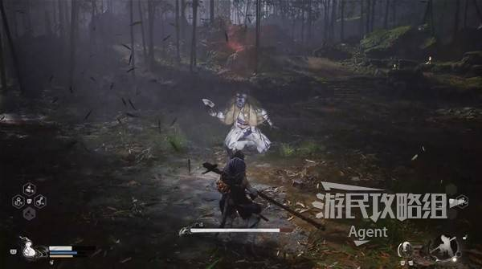

击败广谋后，继续上山去敲第二口钟，然后回来走另一条路前往下一个土地庙。

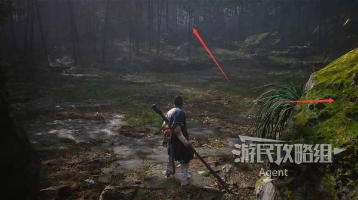

## 第6页：第一回-翠竹林 白雾泽

第一回-翠竹林 白雾泽

土地庙旁，往里走，树干上拿到【落伽香藤】。

走木栈道，先探索左右两边，最后再往下走。

打面前的蛇妖救下树上的申猴，得到【泡酒物】胆中珠，然后申猴会进右边的洞里。左边有个宝箱。

进右边的洞和申猴对话。

以后记得常来找申猴，用落伽香藤升级葫芦、用三冬虫升级酒品。

在“泡制”一栏可设置酒品、泡酒物，土地庙也会解锁这个功能。

在申猴这里可以买到【泡酒物】瑶池莲子。

往下走，到大水池打白衣秀士。注意这个BOSS比较特别，打完还有二阶段变身。

白衣秀士详细打法

## 第7页：第一回-隐·旧观音禅院

第一回-隐·旧观音禅院

打完白衣秀士后，先走左边去敲第三口钟，进入隐藏关卡。等下打完隐藏关卡，再回来继续往前走。

敲完钟后进入隐藏关卡，来到旧观音禅院，院子左边有土地庙，院子右边棺材里拿到【臂甲】南海念珠。

土地庙解锁兵器铸造，初始武器柳木棍可以进行升级。

在披挂铸造解锁制作【锦鳞套装】。

开门来打金池长老，当他升到空中时注意，四周会有很多僵尸向金池长老走去，赶紧消灭这些僵尸，不然金池长老会靠僵尸回血。

金池长老详细打法

击败金池长老后，查看吊着的狼妖（它其实是老狼妖头领凌虚子，被黑熊精复活后不久又上吊自杀了），得到【法宝】辟火罩，专门用于打黑熊精。

## 第8页：第一回-黑风洞 洞内

第一回-黑风洞 洞内

回到刚才打白衣秀士的地方，继续往前走，进入黑风洞。

经过山洞后，先去左边有个【打坐蒲团】，然后再回来走右边。

打坐蒲团旁，拿到【太乙紫金丹】，提升法术上限。

土地庙的披挂铸造解锁制作【青铜套装】，开门打黑风大王。

黑风大王详细打法

击败黑风大王后，学到【法术】聚形散气。

击败黑风大王后，搜刮这个院子两侧，左侧（靠里）一个发光的罐子打碎得到【三冬虫】。

主干道左侧一口钟旁边，开小盒子得到【珍玩】玛瑙罐。

然后钻过帘子继续往前走，来到土地庙。

## 第9页：第一回-黑风洞 洞外

第一回-黑风洞 洞外

离开土地庙往前走，注意木栈道左边可以跳过去拿个宝箱，击败宝箱附近的狼妖得到【精魄】狼刺客。

然后再回来继续往前走，有很多弓箭手，避开弓箭后尽快到房顶干掉他们。

一路走木栈道上山，小亭子佛像前桌上，拿到【九转金丹】，增加气力上限。

## 第10页：第一回-黑风洞 见谛峰

第一回-黑风洞 见谛峰

继续走长长的阶梯上山，来到土地庙，再往上走就是打黑熊精了。

打黑熊精时，别忘了使用隐藏关卡里获得的法宝辟火罩。

黑熊精详细打法

击败黑熊精后获得“根器”，效果三选一，在土地庙洗点时也可以更换根器效果。（注意，每关关底的壁画可以放大查看，有不少对话剧情。错过的话，需要等下一关关底看壁画时往前翻页看）

## 第11页：第二回-沙门村 村口

第二回-沙门村 村口

无头人走后，沿着水往前走，看到一个小木桥。

先去右边上山走到头，石碑前拿到【酒】羔儿酿。然后再回来小木桥走左边。

从小木桥出发，如果继续沿着水走到头，会看到一个大坑里有只大青蛙，先不管，等下会从另一边过去。

我们先走陆地左拐上山，遇到土地庙。

上山走过木栈道，遇到土地庙。土地庙有新的物品可买。初始武器解锁另一条升级线“兽棍”，披挂铸造解锁【乌金套装】。记得买本关的地图，以后每关都要在土地庙买地图。

从土地庙往前走过桥，即可来到沙门村，等下再去探索沙门村。

下图位置左拐绕一圈会来到桥下方的路，我们先探索桥下这条路。

顺着桥下的路走，遇到戌狗，对话得知他的丹方被大青蛙给吞了。

左边走上楼梯也可以抵达沙门村，等下再去。

右边下去大坑打大青蛙“浪里个波”，得到【丹方】避凶药。然后回来交给戌狗，土地庙就会解锁炼丹功能，用药材合成丹药。

浪里个波详细打法

还是遇到戌狗这里，戌狗站的地方旁边有条小路，走过去在小亭子旁有个【打坐蒲团】。

## 第12页：第二回-沙门村 村内

第二回-沙门村 村内

从土地庙旁的小桥进入沙门村，发现大门锁着，门上面房顶有一堆弓箭手，从这边无法上去打他们，先不管。

门左边到高处拿个宝箱，然后去门右边探索沙门村，等下可以从另一面绕到门后，就可以消灭这些弓箭手了。

往右走，小亭子里有个宝箱，从右边的路进入沙门村。

我画的简图是以你离开土地庙时的朝向为准，如果看不懂的话，直接看游民标注的游戏官方地图：

沙门村简图（以离开土地庙过桥进村时，你的朝向为准）：

进入沙门村后，右边的门就是出口门，先别开门，开门的话会立即触发剧情。

佛像前桌上拿到【泡酒物】梭罗琼芽。（这里有只双头鼠，建议先打死）

先去探索左边，等村子都探索完后，再回来开出口门。

往高处走上山，小房子里拿个宝箱。

然后下山回来，一边上房顶打弓箭手，一边往左一路走到底，来到个大院子。

在院子里击败地狼后得到【精魄】地狼。我捡水池里的藕，得到了【泡酒物】嫩玉藕，应该是随机掉落的，你没掉的话没关系，还可以在别处采藕得到。

地狼详细打法

院子里有个亭子，亭子里再次遇到马哥，他被绑着但是不让你救，和他反复对话直到重复为止。

从这一侧就可以开村口的大门了，一堆弓箭手就在门外面，干掉后得到【精魄】鼠弩手。

刚才来大院子的路上，往高处走一点，发现有人躲在房子里说话，过去和他们反复对话，得知三王子在西天佛国。这里需要先把附近村里（刚才来的路上）那只双头鼠打死后，才能持续对话到最后，听到三王子在西天佛国的消息。

探索完村子后，来开出口门，打沙二郎和沙国王。

如果优先打死沙二郎，战斗难度会更简单，沙国王会逃跑，后续还有沙国王的精彩剧情。如果优先打死沙国王，沙二郎会发飙更难打一些，打完获得【精魄】沙二郎，但是后面就没有沙国王的剧情了，只能用块肉去召唤沙大郎。

我个人觉得精魄不差这一个，看完整剧情体验更好，所以先打的沙二郎。如果你在意全精魄的成就，那就先打沙国王。

沙国王&沙二郎详细打法

## 第13页：第二回-沙门村 不济谷

第二回-沙门村 不济谷

沙国王逃跑后，解锁这块的土地庙。

面前的石门暂时打不开，调查门旁的小雕像，得知缺少石之厉、虎之锋。等后面打石先锋和虎先锋后，就可以分别获得这两件物品。

左边的路就是沙国王逃跑的方向，如果走这条路可以更早打沙大郎和虎先锋。

右边的路通往挟魂崖，绕一大圈最后也能抵达打沙大郎和虎先锋的地方。

想先走哪条路就看你的选择了，我选择先走右边，先去挟魂崖。

## 第14页：第二回-挟魂崖 藏风山凹（1）

第二回-挟魂崖 藏风山凹（1）

走右边的路过桥，来到挟魂崖。

走过峡谷的门，来到土地庙。在即将抵达土地庙的路上，调查眼睛发光的佛头得到【佛目珠】。

土地庙左边有条阴暗的路，等下再去。

我们先去探索右边阳光下的区域。

右边一直走到头，树下的棺材里拿到玲珑内丹。

往回走一点，附近有个可以上去的阶梯，拿到个宝箱。

继续走上阶梯到顶部，拿到第二个【佛目珠】。

从阶梯上下来，附近看到一条山沟，山沟左侧拿到第三个【佛目珠】。

然后下去到山沟里，沿着山沟走到头，遇到石中人。

这块区域比较大，再说一个方便定位的标志物——小石桥。先找到小石桥，小石桥下面就是这个山沟。

小石桥附近这棵粗树下，我捡到了火铃草种子，可能是随机掉落的。

在山沟尽头遇到石中人，他说附近山洞里有个石精，接下来我们就去找这个石精。

继续往前探索阳光下的区域，就会抵达下一个土地庙了，先不过去。我们先回到“藏风山凹”土地庙，走左边阴暗的路，一样也能通往下一个土地庙。

## 第15页：第二回-挟魂崖 藏风山凹（2）

第二回-挟魂崖 藏风山凹（2）

回到土地庙，这回走左边阴暗的路。

进门之前，右边木架子下面有个洞，里面有灵蕴捡。

进门后有三条路。

左拐到高处拿到第四个【佛目珠】。

右拐有一个宝箱一个棺材，并且通往阳光下的区域，刚才我们已经探索过了。

探索完左右两侧后，回来往前深入山洞。

穿过山洞，看到下一个土地庙的指引光线，右边出去到阳光下，就是下一个土地庙了，等下再去。

左边有灵蕴捡，然后走左边的路上去，发现山洞中的石精。

前往石精的路上，打这种身体冒蓝火光的石头怪，得到【精魄】石双双。

石精（石母）不会动，但是小心，你打他就会有一堆石头怪出来干扰你。

石母详细打法

打完石母得到【石之精魄】。

打完石母先别急走，旁边出去到外面拿到第五个【佛目珠】。

回到山沟，把石之精魄交给石中人，他居然叫你滚，揍他一顿就老实了，得到【法术】碧尘，在土地庙装备上后可以变身石精。

到土地庙刷新一下再来，就可以在石中人这里买到很多好东西。

可以买到【泡酒物】铁弹、【珍玩】金花玉萼、【醒酒石】。醒酒石是任务道具建议先买。金稳兽不要买，买完会发现价格掉一半上当了哈哈。

## 第16页：第二回-挟魂崖 枕石坪

第二回-挟魂崖 枕石坪

往前走来到“枕石坪”的土地庙。土地庙左边捡到第六个【佛目珠】。

这里有三条路，我们按右、前、左的顺序依次探索。

右边打盾牌怪得到【精魄】骨悚然，继续走上去有个流沙瀑布暂时进不去先不管。

前方是块较大的空地，见到喝醉酒的猪，给他（刚才在石中人那买的）醒酒石，叫醒他。然后反复对话，他说要去卧虎寺找吃的。

悬崖边大树前有个【打坐蒲团】。

左边有个大石头，之前收集齐了6个佛目珠，触摸大石头叫醒石敢当，石敢当会和石先锋对打，石先锋弱得多很快会被干掉，得到【石之厉】。

然后击败石敢当，得到【受蕴】。

石先锋详细打法

石敢当详细打法

石敢当和石先锋这里，走过塌掉的门，来到下一个土地庙。

## 第17页：第二回-挟魂崖 碎石台

第二回-挟魂崖 碎石台

来到土地庙，解锁制作【武器】出云棍、【藏风套装】。

来到街道上，左边院子搜刮一下，前方打妖怪得到【精魄】鼠司空，前方走到头有个【打坐蒲团】，然后走右边的路。

右边岔路口开盒子得到【太乙紫金丹】增加法力上限。

## 第18页：第二回-黄风阵 镇风门

第二回-黄风阵 镇风门

滑下滑坡途中注意有个宝箱，需要跳跃才能拿到。

滑下滑坡后，来到“黄风阵-镇风门”土地庙，无头人教你【法术】身外身法，可以召唤多个小猴子。

右边的石门需要虎之锋才能打开，先向前直走。

往前走打百目真人，得到【精魄】百目真人。

百目真人详细打法

百目真人旁的树上拿到【落伽香藤】，然后继续往前走。

过桥后先去探索左边有个棺材，然后再回来向前走上阶梯。

走上阶梯发现有两个门，一直往上走的石门，就是之前打沙国王、沙二郎父子那里的石门，等下打完虎先锋才能开。

右拐开门，就会来到之前沙国王逃跑的这条路打沙大郎。（开门后左拐可以回到之前打沙国王、沙二郎父子的地方，也就是“沙门村-不济谷”）

开门触发沙大郎的剧情后，先往右拐，看到墙里有个发光的罐子，绕路进去打碎得到【三冬虫】。

打沙大郎时，吸引他去撞这堵很多小佛像的墙，可以撞开一条裂缝（错过不要紧，事后用大头幽魂精魄也能砸开裂缝）。等打完沙大郎，进入裂缝开宝箱得到【飞龙鳞片】（还能看到孙悟空拜师菩提老祖的壁画），这是触发每关的隐藏BOSS龙的道具。

沙大郎详细打法

击败沙大郎得到【阿罗金片】。

打完沙大郎后搜刮附近，然后过小桥钻过狭缝离开。

钻过狭缝后，打蝙蝠得到【精魄】疾蝠。

先去前方打碎障碍物进门，到最里面拿到【九转金丹】增加气力上限。

然后回来走右边，前往卧虎寺。

## 第19页：第二回-卧虎寺 寺门

第二回-卧虎寺 寺门

来到卧虎寺门口，激活土地庙后，从正门走上台阶。

先探索两侧，最后再走上楼梯顶部打虎先锋。

下图右边有个宝箱，左前方有个【打坐蒲团】，右前方遇到之前被你叫醒的猪。

老猪想吃碧藕，一路采集的数量已经不少了，如果身上没有就去有水池的地方采。反复对话，他说要去老地方，指的就是第一次见到他的地方。

虎先锋详细打法

击败虎先锋，得到【法术】铜头铁臂、【虎之锋】。

触摸佛像，血池里会出现地窖入口。

接下来的探索就快要抵达最终BOSS黄风怪了，在此之前，我们先去完成几个隐藏。

## 第20页：第二回-隐·斯哈里国

第二回-隐·斯哈里国

传送到“挟魂崖-枕石坪”，第一次遇到猪喝酒的地方，看右边，老猪（黄袍员外）见金片在你身上一言不合就开打。

击败黄袍员外得到【头冠】长嘴脸，然后随他进入后面的门，来到黄金之国。

黄袍员外详细打法

解锁沙门关土地庙，往前走打“虎先锋”得到【珍玩】虎头牌。

“虎先锋”详细打法

出门解锁沙门界土地庙，然后探索左右两边。

左边房子里开宝箱，得到【虚空结】。

左边走到头，有个【打坐蒲团】。

右边有个棺材，里面有玲珑内丹。

然后到中间土地庙旁的高地上，和老鼠对话，他会擂鼓帮你打BOSS蝜蝂。

当老鼠擂鼓使BOSS倒地后，爬上去取下佛眼。然后老鼠会参战，帮你一起击败BOSS。

蝜蝂详细打法

击败BOSS蝜蝂后，得到【法宝】定风珠，专门用于对付第二回关底的黄风怪。

土地庙披挂铸造解锁【昆蚑套装】，不过只有三件，缺个衣甲。

## 第21页：前两回隐藏龙

前两回隐藏龙

之前打沙大郎那里，撞开墙拿到了飞龙鳞片，可以用来触发隐藏的四渎龙王。（注意当你靠近每个四渎龙王时，都会有葫芦仙人念诗告诉你打法要旨，如果打不过可以等变强以后再来）

传送到“挟魂崖-枕石坪”，右拐走上楼梯听到有人念经，互动进入流沙瀑布，打小骊龙。

小骊龙捶地的冲击波不好躲，立在棍子上可消耗体力不掉血坚持一会儿，或者在附近找石头站上去躲。

小骊龙详细打法

击败小骊龙得到【龙珠】，走上阶梯开宝箱得到【珍玩】砗磲佩。

传送到第一回的黑风山“苍狼林-林外”，进入瀑布打赤髯龙。

参考我画的简图，从土地庙出发，瀑布就在最左边，一直往左走就能找到。

赤髯龙的背部是弱点，击败赤髯龙得到【龙珠】，开宝箱得到【珍玩】博山炉。

赤髯龙详细打法

## 第22页：第二回-卧虎寺 地窖

第二回-卧虎寺 地窖

回到卧虎寺，先从血池的虎口进去探索地窖，等下再回来继续往前走。

隧道左侧开盒子得到【碧藕金丹】增加生命上限。

在洞里打小怪，得到【精魄】狸侍长。

穿过山洞，出口处有个棺材。

滑下滑坡之前，注意看滑坡上面有东西捡。滑下滑坡时，跳起来按重攻击，就可以跳上去，拿到【泡酒物】虎舍利。

滑下滑坡遇到土地庙，旁边见到戌狗和炼丹炉。

对话戌狗，他会送你玲珑内丹，在戌狗处可买到【丹方】延寿膏。

使用玲珑内丹，可以炼天上仙丹，增加各种属性。人间丹药和土地庙的炼丹功能一样。

如果继续滑下滑坡，会抵达最终BOSS黄风怪的所在地，先不过去。

顺便说个小技巧，传送时注意地名后面的小人标志，代表这个地方有已经遇到过的NPC。想找戌狗升级属性时，就传送过来。

第一回的那个申猴也是一样的道理。顺便在第一回的土地庙，可以买到【珍玩】不求人。

到“沙门村-不济谷”，之前打沙二郎的地方，现在可以打开石门了，通往“黄风阵-镇风门”。

“黄风阵-镇风门”土地庙旁的石门也可以打开了，也通往最终BOSS黄风怪的所在地，也先不过去。

## 第23页：第二回-黄风阵 定风桥

第二回-黄风阵 定风桥

回到卧虎寺，从佛像后面的路，继续往前走。

走上坡上山，路边拿到【泡酒物】铜丸。继续上山遇到土地庙。

经过土地庙，过桥后面前的路被堵住了，先搜刮左右两侧的宝箱。

右前方院子里有个棺材，左边一个门帘子里有宝箱。

然后到最左边院子里有个发光的罐子，打碎得到仙品丹药“登仙散”。（如果之前没买醒酒石的话，这里可能会是醒酒石）

过桥后中间被堵住的主干道，稍靠左边一点有路可以绕过去。

下图右边的就是中间主干道，左边小院子有个宝箱。

沿着主干道往前走，打房子上飞下来的红袍怪，得到【精魄】鼠禁卫。

左右两边搜刮下，然后开门继续前进。

出门右拐，树上拿到【落伽香藤】，继续往前走上山来到土地庙。

## 第24页：第二回-黄风阵 定风庄

第二回-黄风阵 定风庄

经过土地庙后，往前走过桥。

过桥后遇到个棺材。

在拱桥上打虎伥，得到【旧拨浪鼓】、【精魄】虎伥。

虎伥详细打法

过桥进入山洞，开小盒子得到【珍玩】琉璃舍利瓶。

穿过山洞，走到头跳下去，发现回到了之前打石敢当、石先锋的地方。

回到定风庄土地庙，往回走进入村子，进门后左拐到院子里，视野色彩会突然变暗，并听到小孩的说话声。

在院子里三个僵尸朝门跪拜的地方，使用拨浪鼓触发剧情。顺便旁边房子里拿个宝箱。

然后到“沙门村-不济谷”，之前打沙二郎的地方，出石门走下阶梯。

出石门走下阶梯后有个桥，不过桥，在桥头右拐进去色彩变暗，使用拨浪鼓触发第二段小孩剧情。

最后到沙门村，之前马哥被绑的亭子附近的角落里，找到一口井，使用拨浪鼓触发第三段小孩剧情。

参考我画的沙门村简图，井的位置在下图圈出位置。

小孩剧情后，跳入井底打疯虎。这个疯虎是卧虎寺那个虎先锋的弟弟，而黄金之国的“虎先锋”是他俩的爹，也就是孙悟空西天取经时打的虎先锋（黄金之国其实是你穿越到了几百年前，而且比孙悟空西天取经时更早）。

疯虎详细打法

打完疯虎得到【精魄】疯虎，洞里棺材里拿到【葫芦】五鬼葫芦。其实这个棺材就是小男孩的棺材，唉！

走出洞外，有个土地庙，传送出去。然后回去找石中人有新对话，因为石中人是这块儿的土地。

## 第25页：第二回-黄风阵 黄风大圣

第二回-黄风阵 黄风大圣

传送到“黄风阵-镇风门”土地庙，开旁边的石门。

经石门来到黄风阵，先左拐走到头遇到【打坐蒲团】和葫芦仙人，然后去右边打BOSS黄风怪。

葫芦仙人告诉你，被魏征梦里斩的那个泾河龙王的鳞片就在黄风岭，指的就是之前我们砸墙拿到的飞龙鳞片。

黄风大圣详细打法

击败黄风怪，得到第二件根器。这一战难度较高，别忘了使用法宝定风珠。

## 第26页：第三回-雪山径 披霜道

第三回-雪山径 披霜道

走出满是佛像的洞，在出去探索冰天雪地之前，回头看有个宝箱，我在旁边水池里又捡到一个泡酒物嫩玉藕，可能是随机掉落的。

走出洞，外面一片冰天雪地，土地庙有新的东西可以买，披挂铸造解锁【赭黄套装】。

如果此时回去找戌狗，可以买到【丹方】益气膏。回去找申猴可以买到【葫芦】宝莲玉葫芦、【泡酒物】霹雳角、【落伽香藤】、【三冬虫】。现在不去也没关系，后面还可以在别处遇到他们。

走雪路上山，右边小亭子旁有条分支路线也搜刮下。

上山打赤尻马猴，打到最后他会逃走。

赤尻马猴详细打法

继续上山来到寺门口，左边有个棺材。

进门搜刮下院子，然后走左边路上去。

走过木地板，打前方小怪得到【精魄】巡山鬼，房子关闭的大门旁有宝箱。

然后回来木地板上，走下图右边的路下去。

建议先搜刮周围，左边亭子里有个宝箱。

一旦过桥到中间的台地上，就会触发小西天土地的剧情。

## 第27页：第三回-雪山径 照鉴湖

第三回-雪山径 照鉴湖

小西天土地带你来到照鉴湖土地庙，先搜刮下湖岸边两侧，最后再去湖里打亢金龙。

湖岸边，右边走到头，我在梨树上采到了交梨种子，可能是随机掉落的。

左边很多僵尸的地方有个棺材，里面有玲珑内丹。

中间的树下，有个【打坐蒲团】。

到湖里触发剧情，打亢金龙时，如果把握时机在召唤出小猴子后刚好把亢金龙打倒在地，一起上去围攻效果奇佳。

当亢金龙飞到空中放闪电时，只要不停留在原地基本就可以躲过。

亢金龙详细打法

## 第28页：第三回-浮屠界 下层

第三回-浮屠界 下层

走出牢房后，和隔壁牢房的神秘人反复对话。先记住每个锁着的牢房（门上有紫色圆圈封印）的位置，稍后想办法打开牢门后再来搜刮牢房。

路边门敞开的牢房顺便搜刮下，往前走遇到灯笼怪狱卒，如果没打死的话它们每过一会儿就会出来查牢房。狱卒一楼有四只，三楼有四只，最后一只在顶层藏着（建议9只都打死，因为在打完魔将·妙音后，他们也会消失，图鉴和掉落物就不能补了）。

监狱的BOSS魔将·妙音每过一会儿就会念经，导致你视野模糊并减你的血条上限，同时召唤出灯笼怪狱卒查牢房。等后面打完BOSS魔将·妙音，念经和狱卒就都会消失。

往前走还有个锁着的牢房，遇到土地庙后左拐，从里面继续往前走。

一路上，牢房内和牢房外，内外两层都搜刮搜刮，往前一直走到头遇到楼梯。

下图往背后走到头有个棺材。

楼梯下面佛像前桌上拿到【珍玩】细磁茶盂，然后走楼梯上二楼。

上来二楼，出门左拐牢房里有棺材。继续往左走到头，可以往下跳洞回到一楼，下面有个锁着的牢房，然后走过土坡会回到最开始你走出牢房的地方。（因为你转了一圈又回来了）

回到二楼，这回出门右拐，继续探索二楼。

一路探索路边牢房，二楼也有个锁着的牢房，然后往前走过木桥。

经过隧道找到上三楼的楼梯，先往前探索完二楼（外面有个宝箱），然后再回来走楼梯上三楼。

## 第29页：第三回-浮屠界 上层

第三回-浮屠界 上层

来到三楼土地庙，看到左边下面洞里有怪。先激活土地庙，然后从左边洞跳下去，先跳到中间房檐上，然后再跳到底部。

魔将莲眼详细打法

跳下来击败魔将·莲眼，得到【珍玩】耐雪枝、【神魂·四将】。（击败魔将后，之前锁着的牢门就可以开了）

然后从这里出去，发现回到了二楼木桥处。

隔壁之前锁着的牢门，现在可以开了，进去打怪得到【精魄】夜叉奴，牢房里还有个棺材。

除了二楼这个锁着的牢房，回到一楼还有三个锁着的牢房（具体位置见上文），都搜刮下。

其中一楼最初你的牢房的隔壁牢房里，见到刚才对话过的小张太子，反复对话得知：他的四大神将被黄眉怪变成了四魔将，他希望你帮他们解脱。（等后面解锁小张太子的图鉴，你就知道小张太子其实就是沙国三王子）

小张太子旁边，躺地上的尸体是第二回里躲在房子里的双头鼠都尉，他千里迢迢来找三王子请他复国，但是三王子不理他，真可怜。拔出他胸前的刀，得到【法术】灰蛰，可以变身双头鼠妖。

如果这里没有尸体，是因为第二回在沙门村你没有和躲在房子里的人对话完，可以试着回去对话再刷新试试。实在不行的话，还可以等做完小张太子的四魔将任务，再到沙门村触发对话，最后再到牢房二楼打双头鼠都尉获得法术。（因为你已经做完小张太子的任务，小张太子已经走了，然后鼠都尉来找三王子就找不到人，鼠都尉没找到人所以疯了，你只好帮他解脱）

回到三楼土地庙，继续探索三楼。土地庙附近牢房里有个棺材。

往前走木桥，左边的洞是可以直接跳进去的（或者过桥后也可以绕路进去拿）。洞里采蘑菇钻出来的怪，击败后得到【精魄】菇男。

往前走发现上四楼的楼梯。

先往前探索完三楼（走到头的牢房里有个宝箱），然后再回来走楼梯上四楼。

上来四楼，先往前走到头有个宝箱。

然后出来走斜木桥上顶楼。

走斜木桥上来后，先去右边搜刮下，等下再回来去左边遇到土地庙。

去右边走到头跳下去，可以抵达一块没去过的牢房区域。（打完魔将·妙音后还可以从另一边跳下去，但是那时候就没有狱卒了）

下去可以拿到两个棺材、【精魄】戒刀僧、【三冬虫】，还会遇到最后一个狱卒，杀完9只狱卒掉落【珍玩】吉祥灯。

## 第30页：第三回-浮屠界 轮藏

第三回-浮屠界 轮藏

离开土地庙，过石桥进入中间的圆筒，击败魔将·妙音，得到【神魂·一将】。

魔将妙音详细打法

继续往前走出圆筒，走过石桥来到下一个土地庙。

左右两边都搜刮下，其中左边有条隐藏的路线也可以抵达上一页的那个隐藏牢房区域。

等下再往前走进入山洞。

左边走到头，从缺口跳下去，也可以抵达上一页的隐藏牢房区域。（之前走斜木桥上到顶层后右拐，也可以从这个缺口跳下去）

如果上一页你没有下去隐藏牢房探索，此时下去可以拿到两个棺材、精魄戒刀僧、三冬虫，但是魔将·妙音已死，此时就看不到狱卒了。

## 第31页：第三回-浮屠界 经筒外

第三回-浮屠界 经筒外

回到经筒外土地庙，进入山洞里有水池，角落的树上拿到【落伽香藤】。

穿过山洞，路边小盒子里拿到【太乙紫金丹】增加法力上限。

然后先别急往前走，翻过小盒子后面的围栏，往里走到头有个【打坐蒲团】。

往前走来到岔路口，先右拐上去打一群人，采到树珍珠。

然后走左边，走上长阶梯，来到下一个土地庙。

## 第32页：第三回-浮屠界 冲寒道、浮屠塔

第三回-浮屠界 冲寒道、浮屠塔

经过土地庙，雪坡有上下两条路。

先右拐向下，过桥后一直往前走，来到浮屠塔激活土地庙，并看到每关结尾解锁的壁画。

等下再回来走左边向上，前往安身寺。

过桥后一直往前走，看到浮屠塔的大门，进入浮屠塔激活土地庙，并看到每关结尾解锁的壁画。然后传送回冲寒道土地庙。

## 第33页：第三回-浮屠界 安身寺

第三回-浮屠界 安身寺

从冲寒道土地庙左拐往上走，岔路口走右边，走上长阶梯来到安身寺。

左边是一片雪地，一路上山也能抵达安身寺外墙。

两边可以都探索下，最终都能到安身寺。

长阶梯右边有个棺材搜刮下，走上长阶梯，来到安身寺土地庙。

另一边大片雪地里也有棺材。经过大片雪地上山，打石台上这只长翅膀拿扇子的怪，得到【精魄】隼居士。

然后走过桥，开宝箱得到【虚空结】，再往前走来到安身寺外墙。

进入安身寺打赤尻马猴，然后葫芦仙人教你【法术】安身法。

房子左侧有个宝箱，继续往前走触发剧情。

## 第34页：第三回-苦海 龟岛

第三回-苦海 龟岛

亢金星君详细打法

打败亢金星君得到【龙珠】，猪八戒朝龟将头部的方向走了（即下图箭头方向），我们先探索下整个龟岛左右两侧，再去找猪八戒。

回头往下走遇到土地庙，土地庙披挂铸造解锁【龙鳞套装】。

土地庙附近悬崖边（龟岛右侧），看到有只龙在钓鱼，这就是本关的隐藏龙。需要在上一关获得飞龙鳞片后才能打他。

青背龙详细打法

击败青背龙得到【龙珠】，开宝箱得到【泡酒物】十二重楼胶。

龟岛两侧都有棺材藏在下层（左侧两个，右侧一个），仔细搜刮下。

龟岛左侧下层有个供桌，拿到【碧藕金丹】增加生命上限。

搜刮完龟岛，到龟将头部这里，和猪八戒对话触发剧情。

## 第35页：第三回-苦海 苦海北岸

第三回-苦海 苦海北岸

龟将把你带到苦海北岸，看到土地庙。

如果你回到安身寺，重走一遍刚才的路，滑下雪坡后，发现之前停靠在南岸的龟岛已经离开（因为现在已经停靠在北岸了），并在岸边发现“苦海南岸”土地庙。

另外，回到照鉴湖，之前打亢金龙的湖面上，右边边缘一颗枯树下，可拿到【泡酒物】困龙须。

龟将带你来到的苦海北岸，从土地庙出发有三条路，我们先探索左右两侧，最后再往前走前往出口。

（此时猪八戒跟着你探索，遇到一些NPC和事件会有很多剧情对话，如果你错过了事后回来补，就看不到猪八戒的相关对话了）

苦海北岸简图：

先往左走，看到远处一个庙门，等下再去。

先到下图圈出的海边，和猪八戒一起打辰龙。

辰龙详细打法

击败辰龙后，他喊着要吃戌狗老弟的丹药。旁边码头上有个宝箱。

继续往前走经过庙门，从妖怪手中救下斗笠和尚，然后反复对话。

左边水池边有个棺材，另一边拿到【酒】蓝桥风月。这个酒可以同时添加三个泡酒物。

苦海北岸简图：

回到苦海北岸土地庙，这回走右边，海岸边有个棺材，并见到蛇将的骸骨。

无量蝠详细打法

和猪八戒一起击败无量蝠后，调查蛇将的骸骨，龟将会落泪。

回到龟将身边，捡到【泡酒物】龟泪，这就是龟将刚才落的那滴泪。

继续走右边蛇将骸骨这条路，途径一个小院子，院子里的树上拿到【落伽香藤】。

继续往前走，进入山洞，洞里有个棺材。

穿过山洞后跳下去，发现绕了一圈来到了土地庙正前方的路上，直达了出口。

## 第36页：如意画轴

如意画轴

传送到“黄风岭-卧虎寺-地窖”，找戌狗拿到药，同时获得【丹方】坚骨药。

回到苦海北岸，把戌狗的药交给辰龙。

辰龙得到药后，会给你【如意画轴】，来到六丁六甲的世外桃源“六六村”。

申猴和戌狗也都来到了这里，每隔段时间来戌狗会送你丹药。

辰龙在右边房子里种地，把收集到的种子交给他，每隔段时间来他会送你种出来的药材。

铁匠寅虎在左边大院子里，在寅虎处可以制作武器装备、升级装备、购买材料。

寅虎详细打法

挑战寅虎获胜后，他会把大刀送你，获得【法术】乌川，可以变身寅虎。

再跟寅虎对话，解锁第三个珍玩（饰品）栏位，并解锁披挂铸造【玄铁套装】。

## 第37页：第三回-苦海 戒语廊

第三回-苦海 戒语廊

苦海北岸简图：

回到苦海北岸土地庙，这回向前直走进入山洞。

洞里左边出去有个棺材，然后往前走过桥来到土地庙。

经过土地庙走下雪坡，左边有个【打坐蒲团】，前面桌上拿到【丹方】聚珍伏虎丸。然后走右边进洞。

往前走，在两排雕像的房间里打红发怪，得到【精魄】赤发鬼。

进入广场中间小亭子里，遇到小和尚触发剧情。

从小和尚右边的路上山，山上有个棺材，走到头发现继续上山的路被堵死了。

回来广场上，小和尚左边有个佛像，过去互动。

猪八戒提示你总共有四个佛像要拜，从旁边的路往下走，去找剩下三个佛像。

走下阶梯后看右边发现第二个佛像。

走下阶梯后左拐穿过洞，往前走见到第三个佛像。

继续往前走穿过隧道，红发怪守着第四个佛像。

拜完佛像，出来跳过围墙回到广场小亭子，和小和尚对话后，上山的路就通了。

之前上山的路被雪堵着，现在可以上去了，走上去钻进洞。

## 第38页：第三回-极乐谷 一念壁

第三回-极乐谷 一念壁

走出隧道，经过土地庙，往前走打“不白”。

不白打到一半会逃走，不白逃走后，先不进洞去追。从旁边山崖跳下去，下面有隐藏的空间可探索。

跳下来后，拿到下面石柱上的灵蕴。

往前走，棺材里拿到【葫芦】燃葫芦。

走出来又遇到这个鬼鬼祟祟的家伙（在第一回黑风山就是看到他后捡到的“色蕴”）。

往前走出来，佛头上拿到【想蕴】，然后跳下去发现回到了刚才打不白的地方。

进洞去追不白。

路上开左边桌上盒子，得到【珍玩】未来珠。

继续往前走，在【打坐蒲团】处再次打不白，击败不白得到【精魄】不白。

不白详细打法

然后滑下长长的雪坡，来到极乐谷的快活林土地庙。

## 第39页：第三回-极乐谷 快活林

第三回-极乐谷 快活林

整个极乐谷面积很大，应把握好几个土地庙的位置避免迷路。

从快活林土地庙出发，进左边的洞（然后一直贴着左侧走）通往“罪业塔林”土地庙，走右边的路下去通往“无忧涧”土地庙，中间的是主路通往“长生大道”土地庙。

中间主路的起点门旁，先和尸体上的小狐狸对话，得知这小狐狸就是上一回结尾动画里的那只狐妖。

变成狐狸后，建议先变回猴子方便搜刮地图，等找到小狐狸想找的人后，再使用白狐毫变狐狸就行。

我画的简图是以你抵达快活林土地庙时的朝向为准，如果看不懂的话，直接看游民标注的游戏官方地图：

极乐谷简图（以你抵达快活林土地庙时的朝向为准）：

## 第40页：第三回-极乐谷 罪业塔林

第三回-极乐谷 罪业塔林

整个极乐谷面积很大，应把握好几个土地庙的位置避免迷路。

从快活林土地庙出发，进左边的洞（然后一直贴着左侧走）通往“罪业塔林”土地庙，走右边的路下去通往“无忧涧”土地庙，中间的是主路通往“长生大道”土地庙。

我画的简图是以你抵达快活林土地庙时的朝向为准，如果看不懂的话，直接看游民标注的游戏官方地图：

极乐谷简图（以你抵达快活林土地庙时的朝向为准）：

从快活林土地庙出发，进左边的洞，打大青蛙“浪里个浪”。

浪里个浪详细打法

然后一直贴着左侧走，经过河流后，来到罪业塔林土地庙。

土地庙附近再次遇到斗笠和尚，等一会儿他会喊冷，用葫芦仙人教的安身法，画个火圈救他。

他坐在火圈里后，和他反复对话，得知他要找的西瓜，在山崖下。

往前走到头有座塔，塔后面拿到【酒】琼浆。

拔塔周围的人参，会拔出个头目“老人参精”，打完掉落【衣甲】山珍蓑衣、【种子】千年人参种子、【精魄】老人参精。

老人参精详细打法

## 第41页：第三回-极乐谷 无忧涧

第三回-极乐谷 无忧涧

整个极乐谷面积很大，应把握好几个土地庙的位置避免迷路。

从快活林土地庙出发，进左边的洞（然后一直贴着左侧走）通往“罪业塔林”土地庙，走右边的路下去通往“无忧涧”土地庙，中间的是主路通往“长生大道”土地庙。

我画的简图是以你抵达快活林土地庙时的朝向为准，如果看不懂的话，直接看游民标注的游戏官方地图：

极乐谷简图（以你抵达快活林土地庙时的朝向为准）：

从快活林土地庙出发，走右边下去见到瀑布和山涧（山沟里的小河），无忧涧土地庙在小河右边高处，一座石桥的桥头。

无忧涧土地庙左右两边的路，都可以通往和尚“不能”。

和尚“不能”双手被绑着，跪在雪地里。打完一管血后，他的双手会解开束缚再打，击败不能得到【精魄】不能。

不能详细打法

到桥下面小河里打鸦香客，得到【精魄】鸦香客。

顺着河走到头，从有两个火盆的地方跳下山崖，来到瓜田土地庙。

翠笠武师详细打法

击败斗笠和尚（翠笠武师）后，真的弥勒佛会教你【法术】禁字法，专门用来打BOSS黄眉怪。

弥勒佛还提到，有位孙悟空的故人在浮屠塔，看来这浮屠塔不简单，以后再说。

## 第42页：第三回-极乐谷 长生大道

第三回-极乐谷 长生大道

整个极乐谷面积很大，应把握好几个土地庙的位置避免迷路。

从快活林土地庙出发，进左边的洞（然后一直贴着左侧走）通往“罪业塔林”土地庙，走右边的路下去通往“无忧涧”土地庙，中间的是主路通往“长生大道”土地庙。

我画的简图是以你抵达快活林土地庙时的朝向为准，如果看不懂的话，直接看游民标注的游戏官方地图：

极乐谷简图（以你抵达快活林土地庙时的朝向为准）：

从快活林土地庙出发，走中间主路，来到长生大道土地庙。

经过土地庙旁的门后，右拐就是出口前往小雷音寺了，最后再去。

先去土地庙右边雪地里有个魔将的尸体，然后去探索搜刮左边的区域，最后再去小雷音寺。

在上图我所站的位置的右边，雪地里发现个魔将的尸体，互动得到【神魂·三将】。

来探索土地庙左边的区域，沿着大路走，一座门旁有个小胖怪，打碎旁边发光的罐子得到【三冬虫】。附近打巨人可能会掉落【珍玩】金棕衣。

沿大路往前走到头，树上拿到【落伽香藤】。

## 第43页：第三回-小雷音寺 寺门

第三回-小雷音寺 寺门

从长生大道土地庙出发，右拐来到小雷音寺的寺门口，打魔将·劫波得到【神魂·二将】。

魔将劫波详细打法

现在神魂一二三四将都集齐了，进入小雷音寺，先用土地庙传送回“浮屠界-下层”的牢房，找小张太子交任务。

等下再回来探索小雷音寺的左中右三条路。

到牢房对话小张太子，他会送你材料打造【武器】楮白枪。棍子玩腻了，就换把枪耍耍。

我画的简图是以你进入小雷音寺正门时的朝向为准，如果看不懂的话，直接看游民标注的游戏官方地图：

小雷音寺简图（以你进入小雷音寺正门时的朝向为准）：

回到小雷音寺，“寺门”土地庙左边是死路先搜刮下。

中间路一直走到头可直通大殿（BOSS房），最后再去。

先探索右边的两条路，其中最右边的路上有重要收集。

走上坡上来最右边的路，背着石碑的巨龟雕像前开宝箱得到【虚空结】。

继续往前走穿过大门，击败海上僧得到【法术】皓霜，可以变身寒冻妖僧。（靠近下图左边那个方形的井，它就会出现）

海上僧详细打法

再往前走，来到个长方形小广场，小广场中间有个泥塑金刚守着。左侧边小亭子里有泡酒物拿。

穿过这个小广场出去，就会抵达地图正中间的广场。

小广场的左侧边小亭子里拿到【泡酒物】甜雪。

经过小广场，来到地图正中间的广场，广场中间房子里，开盒子得到【珍玩】雷榍。广场北面打守着大殿入口的泥塑金刚，得到【精魄】泥塑金刚。

我画的简图是以你进入小雷音寺正门时的朝向为准，如果看不懂的话，直接看游民标注的游戏官方地图：

小雷音寺简图（以你进入小雷音寺正门时的朝向为准）：

然后去广场左边（西面），进房子后走楼梯上楼。在楼上往北走（下图右边的路）再次遇到马哥，反复对话。（如果你不是预购的游戏，预购奖励的争先红葫芦，此时马哥应该会给你）

注：上楼后继续往西走（下图左边的路）通往不空，等下再去。

马哥面对的方向，桌上拿到【丹方】轻身散。

马哥左手边的院子里，拿到【九转金丹】增加气力上限。

到地图最左边（最西面）的房子里，找到小狐狸要找的不空。建议用白狐毫变成小狐狸再进去，会触发剧情。

但是如果你在不空面前使用白狐毫变狐狸，不空就会立即翻脸进入战斗，就没有剧情了。击败不空得到【精魄】不空。

不空详细打法

## 第44页：第三回-小雷音寺 大殿

第三回-小雷音寺 大殿

在小雷音寺里刷盲僧有概率掉落【头冠】闭眼禅。

我画的简图是以你进入小雷音寺正门时的朝向为准，如果看不懂的话，直接看游民标注的游戏官方地图：

小雷音寺简图（以你进入小雷音寺正门时的朝向为准）：

回到地图正中间的广场，往北走来到地图最北面的院子，先去右边打不净得到【精魄】不净，不净所在房间里还有个【打坐蒲团】。

不净详细打法

然后往北走上阶梯，到大门左边激活大殿土地庙。我们先去把支线任务交了，再回来进入大殿打黄眉怪。

传送到快活林土地庙，门旁找小狐狸交任务，得到【珍玩】白狐毫。

进入小雷英寺大殿打黄眉，一阶段血条打完后会被收进袋子，和猪八戒一起打赤尻马猴。

变成赤尻马猴的样子后，一路杀到终点打黄眉的二阶段。二阶段黄眉的金身很硬，虽然等一会儿会自动消失，但还是建议用最猛的攻击强攻打碎金身更有效率。

弥勒佛在瓜田教你的“禁字法”此时可派上用场，如果忘了装备，可使用物品栏里的缩地青符前往土地庙更换法术。

黄眉详细打法

赤尻马猴详细打法

黄眉（二）详细打法

击败黄眉后得到第三件根器、【精魄】无量蝠，变身术多了一个【法术】红眼（变身猴子）。

## 第45页：第四回-兰喜村 朱家大院

第四回-兰喜村 朱家大院

一开始房顶上看到的小姐姐是四姐。

从箱子里出来后，先去背后走到头搜刮一下，然后再回来往前走进村。

村子正门左边还有条路，先下去搜刮下有个宝箱，然后回来从正门进入村子。

进入村子后往前直走，面前房子里有个宝箱，走下图右边的路过桥走到头还有个宝箱。

搜刮完附近后，走下图左边的小走廊，来到土地庙。

左侧房子里有个宝箱，门口的土地庙有新东西可买，解锁制作【武器】狼牙棒、【金身套装】。

传送到如意画轴，戌狗处可买到【丹方】朝元膏，申猴处可买到【酒】松醪、【落伽香藤】、【三冬虫】。

然后回来开门触发剧情。

二姐详细打法

打完二姐，搜刮下院子。院子右边有两个房子，下图右边房子里打发光罐子得到【三冬虫】，下图左边房子里有宝箱和棺材。

往里走，来到下一个院子，桌上拿到【碧藕金丹】增加生命上限，然后从院子中间的大洞跳下去，来到盘丝洞。

## 第46页：第四回-盘丝洞 上层

第四回-盘丝洞 上层

注意：如果你看到大量蜘蛛、蜈蚣会感到不适，请把画质、清晰度等调到最低，看不清真实细节的话，应该会好一点。只能帮你到这了哈哈哈。

掉到蛛网上是四姐救的你，醒来后在桌上拿到四姐给你留的药。里面开宝箱得到【珍玩】错金银带钩，用来抗毒。

走上坡出来遇到土地庙，解锁【武器】几丁棍。传送到朱家大院，会发现天亮了，打院子里的怪得到【精魄】幽灯鬼，然后再传送回来。

先去搜刮左边，等下再回来走右边土地庙旁的路深入探索盘丝洞。

左边又有两条路，而且走到头都是死路。

往下走房子里有宝箱，并看到个断桥，可以先看看断桥对面以及周围的场景，稍后我们会从另一边过去。

左边阶梯走上去，高处房子里拿到【泡酒物】血杞子。继续往上走还可以搜刮到棺材，往上走到头发现回到了刚才你跳下深坑落地的地方，四姐就是在这救的你。

搜刮完那边的两条死路后，回到土地庙，走土地庙旁边的路。

来到岔路口，左右两条路是相通的，转一圈就互通了。

注意路边的木板，这是可以向下跳的提示，接下来你会遇到很多这种木板。

我们先从左边木板处跳下去，去探索一条比较长的隐藏路线（通往碎玉池）。等下再回来走大路往前深入探索盘丝洞。

如果你沿大路往前走了一点，可以从另一面看这个木板，并看清跳下去的路，如下图：

## 第47页：第四回-盘丝洞 碎玉池

第四回-盘丝洞 碎玉池

跳下来遇到很多吊着的蜘蛛茧，注意右边，打破蜘蛛茧发现洞里有宝箱。

往前走还有很多蜘蛛茧，一路往前走来到有只蝎子精的上坡。见到蝎子精建议都打死，和成就有关。

走上坡后，遇到“碎玉池”土地庙，水中有个【打坐蒲团】。（走到悬崖边，你会发现来到了一开始那个断桥的另一头）

从土地庙旁的路继续往前走。（如果你怕蜈蚣，千万不要抬头看！）

先听他说话，然后打破怪茧，打黑手道人。当黑手道人趴在地上露出背上的手臂时，定住然后打断他背上的几个手臂，可得到【臂甲】下毒手。

黑手道人详细打法

## 第48页：第四回-盘丝洞 花间桥

第四回-盘丝洞 花间桥

回到“上层”土地庙，这回走大路往前，小心路上的弓箭手。

经过弓箭手后，先去右边洞里有棺材和【精魄】虫校尉。

然后回来往前走到头遇到木板，往下跳。

从木板处跳下，连续多次往下跳，来到“花间桥”土地庙。

离开土地庙过桥，路口的茧里会跳出小怪。另外，我在打这里的茧时掉落了【茧圆】，可能不是固定位置掉落，记得多刷刷，整个盘丝洞有三个茧圆，先拿着后面有用。

过桥后有左右两条路，为避免转晕了，建议右边就别去了，直接走左边。（右边没啥东西，走到头跳下去会和左边的路会合）

过桥后走左边，听到俩灯笼在喊“大喜！大喜！”，到灯笼处触发四姐的剧情。

剧情后进门（下图右边）拿一堆宝箱，等下再回来继续往前走。

进来开宝箱得到【葫芦】湘妃葫芦、【泡酒物】紫纹湘核、【丹方】加味参势丸等等，然后继续往里走打琴螂仙，得到【琴螂原体】。

琴螂仙详细打法

出来继续往前走，走下坡遇到很多茧。

经过茧后，来到分岔路口。

左右两条路其实是相通的（都能打蝎子精），右边路如果一直往前走可抵达“千红窟”土地庙，等下再去。

先走左边路上去。

走左边路上来，打蝎子精得到【精魄】蝎太子、【泡酒物】倒马毒钩，树上拿到【落伽香藤】。

干掉蝎子精后，走上旁边的阶梯。

小房子里拿到【丹方】镜中丹，然后过桥看到一座发紫光的小塔，触发四姐剧情。

四姐走后，把小塔上的符纸揭下来。

然后进旁边房子里拿水壶，得到【酒】无忧醑。

继续往前走遇到【打坐蒲团】，再往前走来到“中层”土地庙。

## 第49页：第四回-盘丝洞 中层

第四回-盘丝洞 中层

土地庙左边下去有个棺材，然后回来走右边。

到大坑里打百足虫，得到【精魄】百足虫。然后从大坑旁的路继续往前走。

百足虫详细打法

靠近这个超大号茧时听到有人的声音，打破茧救出马哥。

和马哥反复对话，他要和你在火焰山再会。他说的大王显然是牛魔王。

继续往前走，经过小圆石桌后，打挡路的茧掉落【茧圆】。

走上来看右边，小塔处揭第二张符纸，房子门口有个宝箱。

然后来到“绝想崖”土地庙。

先回去探索刚才没走的那条路，等下再回来继续深入探索盘丝洞。

## 第50页：第四回-盘丝洞 千红窟

第四回-盘丝洞 千红窟

传送到“花间桥”土地庙，走右边路，从木板处跳下去。

跳下去后直接往前走。

打掉左边的茧，到洞里打怪和茧，得到【精魄】傀蛛士、【茧圆】。然后继续往前走，来到“千红窟”土地庙。

经过土地庙继续往前走，发现来到了刚才打百足虫的地方。接下来就是遇到马哥，然后来到“绝想崖”土地庙了。

## 第51页：第四回-盘丝洞 绝想崖

第四回-盘丝洞 绝想崖

回到“绝想崖”土地庙，继续往前走，打右手虫，得到【照骨镜】、【佛手·右】。

右手虫详细打法

四姐剧情后，走过右手虫搭成的桥。

过桥后先左拐，拿到【太乙紫金丹】增加法力上限。

然后再回来桥头木板处往下跳。

一路往下走，经过个小水池，来到分叉路口。

我们先从左边跳下去过大桥。右边不用担心，等下探索完左边后，会刚好落到右边的路上。

过大桥后，洞里右侧有个宝箱，往前走遇到个小桥。

这个小桥很容易掉下去导致重来，建议就不要跟这里的茧死磕了。离悬崖远些，用聚形散气隐身，然后再过小桥。（小心，面对悬崖太近的话，用聚形散气隐身也会掉下去，所以要站远些）

过小桥后，来到树林，路右边悬崖边的树上拿到【落伽香藤】。

继续往前走，经过一堆棺材的乱葬岗，来到“堕龙壁”土地庙。

## 第52页：第四回-盘丝洞 堕龙壁

第四回-盘丝洞 堕龙壁

经过土地庙继续往前走，打最后一个“四渎龙王”小黄龙，原来他们都是泾河龙王的儿子。葫芦仙人原来就是袁守诚。（飞龙鳞片和前三只隐藏龙的位置，见前三关的攻略）

等下回来去下图左边，有只蝎子精。

打小黄龙不要贪刀，拉开距离他的攻击欲望会降低。击败小黄龙，得到【龙珠】、【珍玩】金色鲤。拾取他的武器，得到【法术】金岚，可变身小黄龙。

小黄龙详细打法

干掉蝎子精后进入山洞，进洞后先右拐走到头，打小怪得到【精魄】儡蜱士。

然后去洞左边，走上坡。

走上坡遇到小塔，揭第三张符纸。

先去右边开宝箱有【虚空结】，然后从小塔旁的木板处跳下去。

## 第53页：第四回-盘丝洞 底层

第四回-盘丝洞 底层

跳下来后，发现来到了，刚才过大桥前没走的那条右边的路。

从木板处跳下去。

走过狭缝触发一长段剧情，看到猪八戒要和蜘蛛夫人成亲。

剧情后往前走，从木板处跳下去。

一路经过很多蛛网，先走中间的山沟到尽头拿个棺材。然后走左右两边的路都可以。

往前走，看到高处桥上有个弓箭手，需要钻过右侧的狭缝才能上去打他。

往前走到桥下遇到“底层”土地庙。先去激活土地庙，然后再回来钻过下图右侧的狭缝。

钻过狭缝后走上上坡，先去右边有个【打坐蒲团】，然后去左边打桥上那个弓箭手。

打完桥上的弓箭手，继续往前走，来到水池打“波里个波”，得到【佛手·左】。

波里个波详细打法

## 第54页：第四回-盘丝洞 若仙庵

第四回-盘丝洞 若仙庵

回到“底层”土地庙，往前走来到“若仙庵”土地庙，右边房子就是刚才猪八戒和蜘蛛精动画所在的地方。

猪八戒详细打法

击败猪八戒后，出来回到土地庙，走另一边钻过狭缝，再次打猪八戒，得到【染血绣针】、【珍玩】月玉兔。

猪八戒再次被抓走，从下图位置进洞有个宝箱，然后来到“濯垢泉”土地庙，解锁【不净套装】。

## 第55页：第四回-盘丝洞 濯垢泉

第四回-盘丝洞 濯垢泉

离开土地庙继续往前走，这里有个大水池，先去左边水池尽头，再次看到鬼鬼祟祟的家伙，拿到【行蕴】。

然后回来走右边路往上。

上来穿过山洞，右边有个棺材，走上阶梯打蝎子精。

蝎子精附近悬崖边有个弓箭手，打死得到【精魄】蜻蜓精。

继续往前走，上来来到“万慈窟”土地庙。

## 第56页：第四回-盘丝洞 万慈窟

第四回-盘丝洞 万慈窟

紫珠儿详细打法

击败紫蛛儿后大量蜘蛛涌来，赶紧向前冲逃命。然后又是四姐救了你。

被四姐救后，树上拿到【落伽香藤】，然后来到黄花观“山道”土地庙。

## 第57页：第四回-黄花观 山道

第四回-黄花观 山道

经过土地庙后上山。

遇到有围栏的地方，围栏后面桌上拿到【泡酒物】蜂山石髓。

继续上山走上阶梯，雕像前有个棺材，然后右拐继续往前走。

过桥后穿过山洞，走上来雕像前拿个宝箱，然后继续往前走。往上走过木桥，来到土地庙。

## 第58页：第四回-黄花观 虎蛇虫林

第四回-黄花观 虎蛇虫林

经过土地庙来到树林。

先左边走到头，悬崖边有个【打坐蒲团】。

然后回来继续往前走。

走上阶梯，看到道士们在练武。

虫总兵详细打法

击败虫总兵，得到【精魄】虫总兵，雕像前拿到【珍玩】三清令。

打完虫总兵，先去房子旁的小路拿个宝箱，然后回来走上阶梯，来到土地庙。

## 第59页：第四回-黄花观 观门

第四回-黄花观 观门

经过土地庙，走上长长的阶梯，进门来到个院子。院子中间的粗树下有个宝箱。

看院子左右两边，各有一条路。我们先进右边的门，等下再回来去左边走上阶梯。

进右边的门后，左边树旁有个有个【打坐蒲团】。

往前走上阶梯打怪得到【精魄】蛇捕头，然后上去进门见到葫芦仙人。

和葫芦仙人反复对话。多听一会儿他弹的曲子，发现他弹的正是本关的主题曲《戒网》，八戒和蜘蛛网啊！

葫芦仙人旁，打碎发光的罐子，得到【三冬虫】。

回到院子，左边走上阶梯。

来到岔路口，左边通往“金光苑”土地庙和最终BOSS了，先去解锁土地庙，但是千万别再往前走了。

然后回来先走右边，有隐藏关卡。

走过右边的房子，房子里有个宝箱。

一路走上上坡，走上最后一段阶梯后，有左右两条路。

先去右边搜刮下。

左边是个下坡，等下再回来走下下坡。

右边走到头有个房子，拔房子前空地上的蘑菇会出来个菇女，击败得到【精魄】菇女、【种子】猴头菌种子。

房子门口拿到【酒】九霞清醑。

回到刚才的阶梯处，这回走左边走下下坡，打黑手道人。

黑手道人详细打法

击败黑手道人后，先不触摸有壁画的墙壁，先过旁边的门，拿个宝箱。

## 第60页：第四回-隐·紫云山 千花谷、绕仙居

第四回-隐·紫云山 千花谷、绕仙居

击败黑手道人后，触摸有壁画的墙壁来到紫云山。

来到桥头，和树上的红蛇反复对话，旁边拿个宝箱，然后过桥。

来到土地庙，商店有新东西可买，过旁边的桥。

过桥后有左右两条路，虽然这块区域比较大，但只需把握这左右两条路线即可。

我们先去探索右边，等下再探索左边。

过桥后右拐，（桥的右边）打树妖得到【精魄】青冉冉，树上拿到【落伽香藤】。

然后往前走（桥的右前方），走过一道门来到“绕仙居”土地庙。

走门左边的坡上去，有个【打坐蒲团】。

走上土地庙旁的阶梯，遇到毒敌大王触发剧情，打碎毒敌大王的酒坛会触发毒敌大王BOSS战。（之前你打的四个蝎子精，是毒敌大王的儿子。要不要打这个毒敌大王，建议先看完下文再做决定）

毒敌大王在房顶上喝酒，如果你打碎他的酒坛，就会开打。击败毒敌大王得到制作【衣甲】昆蚑毒敌甲（第二关黄金国解锁的套装，缺的衣甲就是这个）的材料、【葫芦】彩玉葫芦。但是等下他就不会出现帮你打晦月魔君了，也就没有相关的剧情。

如果你不理毒敌大王，或者开打后死掉，只要没杀了他，等下他就会出现帮你打晦月魔君。但是就不会掉落制作昆蚑毒敌甲的材料、以及彩玉葫芦了。

毒敌大王所站的房子里有个宝箱，可以不碰酒坛直接拿。如果你不小心打碎了酒坛但是不想打他，那就等打完晦月魔君后，记得回来拿。

毒敌大王详细打法

回到“千花谷”土地庙旁的桥，这回探索左边。过桥后左拐，打蛇妖得到【精魄】蛇司药。

走下图左边的坡上去，然后走过房顶，到高处开棺材得到【珍玩】日金乌。

然后走过下图正前方的门，来到“落花庄”土地庙。

土地庙右边，有个小亭子，亭子里拿到【珍玩】仙篆。

然后回来经过土地庙往前走，来到落花庄。

## 第61页：第四回-隐·紫云山 落花庄

第四回-隐·紫云山 落花庄

走过小桥，来到落花庄。

走上阶梯后先左拐见到糜道人，等下再分别去右边和前方探索庄子。

和糜道人对话后，先去刚才说的右边探索庄子，搜刮下房子里的几个宝箱，穿过一个房子时拿到【丹方】保命丹。

穿过这个房子后再往前走，遇到“巢云顶”土地庙，先别走上土地庙旁的楼梯，走上去就是晦月魔君BOSS战了。

然后从糜道人旁的门进入庄子探索，也能拿到几个宝箱。

进门后回头看，门上面发光的罐子里有【三冬虫】。

宝箱位置地图：

搜刮整个庄子，打道士，直到掉落【藕雹】。

回来找糜道人，给他藕雹，击败糜道人后红蛇出现，得到【法术】藕雹，可变身毒虫。

靡道人详细打法

## 第62页：第四回-隐·紫云山 巢云顶

第四回-隐·紫云山 巢云顶

来到庄子里的“巢云顶”土地庙，走上楼梯去打晦月魔君。

如果毒敌大王还活着，中途他会出现帮你打晦月魔君，但是晦月魔君进入二阶段后，毒敌大王还是会死。

毒敌大王出现时会喊“夫人，我来亲手替你报仇了！”因为晦月魔君其实就是昴日星官，当年孙悟空西天取经时，女儿国那个母蝎子精就是被昴日星官收服的，而那母蝎子就是毒敌大王的夫人。

晦月魔君详细打法

击败晦月魔君后，得到【法宝】绣花针，专门用来对付百眼魔君。这绣花针非钢、非铁、非金，乃是从昴日星官的眼睛里炼成的，专克那蜈蚣精。

同时得到【泡酒物】双冠血。

## 第63页：第四回-黄花观 金光苑

第四回-黄花观 金光苑

回到“金光苑”土地庙，右边是百眼魔君最后再去，我们先向前直走来到天王殿。

听到四姐向你嘶喊“快走”，到最后一个小塔处揭符纸，和王灵官打一会儿就会结束，然后见到鹤仙人。

左边两个小道士守着个宝箱。

听鹤仙人说话的意思，小猴子像是孙悟空的转世。四姐被鹤仙人带去炼丹去了危在旦夕啊，难道还要去天庭救四姐不成，我要救四姐！看背景故事得知，蝎子精想让毒敌大王的儿子们和蜘蛛姐妹们联姻，难怪四姐总想离开这鬼地方。

鹤仙人走后，进房子拿到【九转金丹】增加气力上限，然后去拿两个小道士守着的宝箱。

传送到如意画轴，找申猴，用盘丝洞里获得的左右佛手买到【葫芦】妙仙葫芦。

把琴螂原体交给辰龙，刷新后在辰龙的院子外发现个小琴螂，喂它吃三个茧圆。

然后再刷新后再来，得到【精魄】琴螂仙。

回到“金光苑”土地庙，去右边触发剧情，和蜘蛛姐妹们一起打百眼魔君。

当百眼魔君金光四射时，使用绣花针可直接破了他的二阶段，战斗难度大大降低。

百眼魔君详细打法

击败百眼魔君后，得到第四件根器。

## 第64页：第五回-灰烬林 火燎一关

第五回-灰烬林 火燎一关

和猪八戒一起清小怪，开门来到土地庙。商店有新东西可买，解锁【羽士套装】。

传送到如意画轴，戌狗处可买到【丹方】龙光倍力丸，申猴处可买到【落伽香藤】、【三冬虫】。

传送回“黄花观-金光苑”，刚才打百眼魔君的地方可搜刮到棺材。

回到第二次打黑手道人的地方（紫云山入口，即画着紫云山壁画的那堵墙那里），经过旁边的门，在大树旁看到紫蛛儿的墓碑。

这应该是蜘蛛姐妹们为母亲立的，墓碑前拿到【珍玩】定颜珠。

回到火燎一关土地庙，往前走看到两拨人在打架，还有五行战车在投火球。

往前走到树下，击败皓斧力士，然后和他对话。

皓斧力士详细打法

和皓斧力士反复对话，然后上山去帮他打五行战车。

搜刮附近几个棺材后，走阶梯上山。

上来遇到褐铁战车，走右边的路绕到它背后去打它。

第一关得到的法宝辟火罩，在本关很有用，尤其是打带火的BOSS。

## 第65页：第五回-灰烬林 春秋寨

第五回-灰烬林 春秋寨

往前走来到土地庙，然后过桥。

往前走，走过小木桥有个棺材。

站在棺材这，看到有两条上山的阶梯路。

下图右边这条路，上去有个【打坐蒲团】。

来到另一条阶梯这里，先到左边走到头去拿个棺材，然后回来走阶梯上去。

走阶梯上来后，路边小亭子里拿到【泡酒物】灵台药苗。

## 第66页：第五回-灰烬林 灰烬台

第五回-灰烬林 灰烬台

过桥后走上阶梯，来到土地庙。

往前走，击败石父得到【精魄】石父。

石父详细打法

先往前走下去搜刮几条死路，然后再回来开右边的门。

到前面拿个宝箱，然后回来往下走。

往下走过门后，右边走到头树上拿到【落伽香藤】，左边是一波小怪。

搜刮完后，回来刚才打石父的地方，开门看到悬崖下的灰铜战车。

先不管战车和喊救命的人，直接过桥进洞。

这个洞其实不大，只不过柱子多容易转晕。

进洞后右拐，右边小洞里拿到【珍玩】琥珀念珠。

往洞深处走，打这个身上冒蓝火光的怪，得到【精魄】黑脸鬼。

往前走出洞，到右边拿个棺材，然后下去打战车。

战车喷火时，躲到侧边的小洞里就行。

击败灰铜战车，往前走看到喊救命的小狐狸，再击败快如风、急如火，来到土地庙。

急如火&快如风详细打法

现在已经打了第二辆战车，可以回去春秋寨找皓斧力士对话，等下他会帮你打第三辆战车。或者不去找他也行，等自己打完第三辆战车后再去找他对话，剧情会不太一样。

## 第67页：第五回-灰烬林 火燎二关

第五回-灰烬林 火燎二关

土地庙旁，拿到【碧藕金丹】增加生命上限。

跟随小狐狸穿过隧道，看到被火挡住的路，等后面芭蕉扇灭火后就能走了，通往隐藏关卡。不过这条路并没什么用，因为我们会从另一边过去。

往前走跳下山崖，来到丹灶谷。

## 第68页：第五回-丹灶谷 谷口

第五回-丹灶谷 谷口

离开水池，经过土地庙，走过山道看到一道门。

我们先探索门的左右两边，最后再走过这道门。

左边路走到头打燧统领得到【精魄】燧统领，然后回来去探索门右边的区域。

燧统领详细打法

探索门右边的区域，见到一辆坏掉的五行战车，旁边有个宝箱。

马哥被封在了五行战车里，反复拽鞭子，直到对话重复。此时还拔不出鞭子，等下再说。

沿着马哥旁的岩浆河，走到头有个宝箱，打怪得到【精魄】鳖宝。

回来走过这道门。

走上坡后，先左拐可拿到棺材、【精魄】地罗刹。

然后继续往上走，打云里雾、雾里云，得到【精魄】雾里云·云里雾。

云里雾&雾里云详细打法

继续走上阶梯，开门来到土地庙。

## 第69页：第五回-丹灶谷 罗刹宫

第五回-丹灶谷 罗刹宫

土地庙旁，拿到个宝箱和【太乙紫金丹】增加法力上限。

沿大路往前走。左右两边的岩浆是可以站人的，顺便过去搜刮下有宝箱。

沿大路走上来看到拿盾的巨人怪，先去左边见到葫芦仙人袁守诚，等下再回来走右边。

左拐有个大洞，进来见到葫芦仙人袁守诚，打碎发光的罐子得到【三冬虫】。

和他对话后，找申猴把游戏初始的葫芦升级到满级（能喝9口），就可以在火堆处拿到【葫芦】上清宝葫芦。其实就是给你再升一级，现在能喝10口了。

沿着大路继续往前走，来到土地庙。

## 第70页：第五回-丹灶谷 翠云殿

第五回-丹灶谷 翠云殿

经过土地庙后，触发剧情。

火焰山土地曾是太上老君的烧炉童子，孙悟空当年踢翻炼丹炉，几块内有余火的炉砖落到人间成了火焰山，他也被牵连被太上老君罚下界，当了火焰山的土地。

火焰山土地详细打法

阴阳鱼详细打法

击败火焰山土地后，得到【衣甲】阴阳法衣。战斗途中，马哥的魂都被他利用了，唉，我的马哥。

战斗后搜刮附近，靠悬崖这边有个【打坐蒲团】。

面向铁扇公主的座位，大殿左边拿到【泡酒物】瞌睡虫蜕。

铁扇公主的座位上，拿到【酒】龙膏。

回来找马哥，拽出鞭子，得到【法术】黯雷，可以变身马哥。战斗时变身马哥，你会发现马哥还有马老师的技能“闪电五连鞭”。

回到翠云殿，从铁扇公主座位左边的路继续往上走，路边捡个宝箱，再往上走打红银战车。

如果之前你打完第二辆战车后，回去找皓斧力士对话了，他会帮你打红银战车。打完后和他反复对话。

如果没有，你打完红银战车后，继续往前走解锁“火燎三关”土地庙，传送回春秋寨找皓斧力士对话。然后再回到打红银战车的地方，和皓斧力士对话，他会怨你都打完了，没有给他留一个。

皓斧力士说五行车有五辆，目前已经打了三辆，还有一辆是马哥那辆坏的不用打，所以只剩最后一辆了。

在打红银战车的地方，皓斧力士让你去找璧水金睛兽。

## 第71页：第五回-火光地 火燎三关

第五回-火光地 火燎三关

在打红银战车的地方和皓斧力士反复对话后继续往上走，来到土地庙。

先去探索右边，等下再去左边。

到土地庙右边采蘑菇会出现九叶灵芝精，击败得到【头冠】地灵伞盖、【精魄】九叶灵芝精、【种子】九叶灵芝草种子。

旁边还有个【打坐蒲团】。打坐时看到骨瘦如柴、奄奄一息的牛魔王。

回到土地庙继续往前走，遇到钉刺球。

往路两侧的缝隙躲，待钉刺球滚远，然后迅速先前冲，再找下一处路边的缝隙躲起来。

一边躲钉刺球，一边往前走，途中有个宝箱。

再往前走，看到路边的火焰，先记住这里，等下芭蕉扇灭火后，要从这里前往隐藏关卡。

猪八戒和钉刺球掉下山崖后，注意他们掉落的位置，等下有用。

跟随小狐狸往前走，解锁“陨砖坑”土地庙，然后就不要再往前走了。（一口一个甜甜的猴哥哥，可别猴急猴急昏了头哈哈）

传送到翠云殿，往上走，找到撞到石头上的钉刺球，拿到【精魄】兴烘掀·掀烘兴。

## 第72页：第五回-火光地 清凉坡

第五回-火光地 清凉坡

从“陨砖坑”土地庙往回走，找到刚才被火挡住的路，刚才芭蕉扇已经灭了火，走这条隐藏的路前往隐藏关卡。

来到这条隐藏的路上，左边树上拿到【落伽香藤】，右边靠近碎石块打燧先锋得到【精魄】燧先锋。

燧先锋详细打法

往前走有个棺材。

再往前走，与地上的红圈互动打火灵元母得到【精魄】火灵元母。触发这个战斗需要四个火灵砂，缺的话去土地庙买。

火灵元母详细打法

继续往前走，路边有个棺材。

然后遇到土地庙。

一直往前走到头，打赤金战车，得到【珍玩】阳燧珠。

和皓斧力士对话，然后打开封印。

进洞后，可以先去左边打波浪浪（也可以等探索完璧水洞后，出来时再打），然后靠近柱子（其实是牛魔王的武器混铁棍）来到璧水洞。

波浪浪详细打法

## 第73页：第五回-隐·璧水洞 炼魔坑

第五回-隐·璧水洞 炼魔坑

进入璧水洞往里走，路边棺材里拿到【丹方】七返火丹。

然后进门来到土地庙，商店有新东西可买。

进门来到土地庙，先右拐走到头有个【打坐蒲团】，然后去左边打BOSS掀烘兴和兴烘掀。

掀烘兴和兴烘掀，不是刚才随钉刺球落下山摔死了嘛，精魄都拿了，怎么又活了？其实是因为，隐藏关卡是过去的回忆。

兴烘掀&掀烘兴详细打法

打完掀烘兴和兴烘掀，走上阶梯往前走，注意路左侧拿到【九转金丹】增加气力上限。

## 第74页：第五回-隐·璧水洞 洞天深处

第五回-隐·璧水洞 洞天深处

往前走来到土地庙。

走廊左侧有个宝箱，打前面那只头领得到【精魄】牯都督。

往前走来到岔路口，左边滑下冰坡或者右边直接走下去都可以。

左边滑下冰坡途中，从中途断口处跳到下面去，也可以。

总之三条路是相通的，到下面拿到个宝箱。

继续往前走，路边拿个棺材。然后滑下冰坡来到土地庙。

## 第75页：第五回-隐·璧水洞 水火道

第五回-隐·璧水洞 水火道

经过土地庙，来打璧水金睛兽。不要直接打死它，不然就体验不到最初设计的乐趣了。

吸引它朝被冰堵住的门喷火，就会出现通路。

进门后往前走，路左边有个【三冬虫】。

来到第二处战斗地点，吸引它朝火墙喷冰，就会出现通路。

然后滑下冰坡，到最后的地点击败璧水金睛兽，得到【珍玩】水火篮。

璧水金睛兽详细打法

剧情后回到入口，来的时候没打洞里的波浪浪的话，记得去打。

## 第76页：第五回-火光地 陨砖坑

第五回-火光地 陨砖坑

回到陨砖坑土地庙，解锁【大力套装】。

来到牛魔王面前，打红孩儿。红孩儿二阶段会变身夜叉王，把夜叉王打到只剩一丝血时，放着不打等一会儿，会触发额外的处决动画，不过不会影响后续剧情。

红孩儿详细打法

夜叉王详细打法

击败夜叉王后，获得第五件根器、【法宝】芭蕉扇。

最后看壁画时，可以放大细看各个人物，有很多剧情对话可以触发。前四关如果忘了看，此时可向前翻页查看。

## 第77页：第六回-山脚 青嶂道

第六回-山脚 青嶂道

一路打天兵天将，往前走来到土地庙，解锁【厌火套装】，商店有新东西可买。

传送到如意画轴，申猴处可买到【葫芦】乾坤彩葫芦、【酒】千日醉、【泡酒物】百花蕤。

虽然此时你可以去最后一个隐藏关，但是不建议去，因为提前打完最后一个隐藏关，你就只能有一个结局了。跟着我全结局不好嘛。

回到青嶂道土地庙，往前走打王灵官，就是他抓的四姐，还我四姐命来！

他最后的火圈，可以用芭蕉扇破除。

王灵官详细打法

击败王灵官后，得到【法术】筋斗云、【丹方】登仙散。

此时注意你所站的位置（即获得筋斗云后的起点，如下图），观察周围环境，一定要记住这个地方，不然会迷路。

看到面前悬崖下方是一条河，猪八戒向右边的两个有闪电的地方飞走了，等下拿完凡品大圣套装后，我们会回来这里，然后先去右边探索，最后再去左边探索。

我画的简图是以你获得筋斗云后的朝向为准，如果看不懂的话，直接看游民标注的游戏官方地图：

花果山简图（以你获得筋斗云后的朝向为准）：

得到筋斗云后，先转身看背后，往回走，有很多铁链的山谷就是刚才打王灵官的地方。

原路返回（建议步行，避免迷路），回到青嶂道土地庙，然后来到本关开始的起点。

在本关起点处召唤筋斗云飞起来，看到左边大树下有个宝箱，开宝箱得到【凡品大圣套装】。

## 第78页：第六回-山脚 望犀坡

第六回-山脚 望犀坡

我画的简图是以你获得筋斗云后的朝向为准，如果看不懂的话，直接看游民标注的游戏官方地图：

花果山简图（以你获得筋斗云后的朝向为准）：

回到刚才让你记住的，获得筋斗云后的起点（如下图）。

先乘筋斗云向前，看面前的正下方有个水池，落到水池里打跳浪蛟。然后我们会先去右边跟随猪八戒的脚步探索，最后再去左边探索。

落到面前下方的水池里，打跳浪蛟得到【珍玩】避水珠。（本关很多地方都是，必须从筋斗云上下来，妖怪才会出现或者进入战斗）

跳浪蛟详细打法

打完跳浪蛟后，从筋斗云起点出发，往右来到河边高地上的望犀坡。望犀坡和见鹿林都有大大的闪电，很好发现。

落地后先解锁土地庙，然后到空地上打金甲犀。

金甲犀的犀牛角很强，打掉后过一会儿还会再长出来，在打掉犀牛角后它会虚弱一阵。击败金甲犀得到【衣甲】锁子黄全甲。

金甲犀详细打法

望犀坡附近的河边有块空地，过去打最后一只大青蛙——浪波波，得到【珍玩】仙胞石片。然后青蛙精魄也可以升满级了。

浪波波详细打法

## 第79页：第六回-山脚 见鹿林

第六回-山脚 见鹿林

我画的简图是以你获得筋斗云后的朝向为准，如果看不懂的话，直接看游民标注的游戏官方地图：

花果山简图（以你获得筋斗云后的朝向为准）：

来到河对岸的见鹿林，这里有很多红色的树，而且也有大闪电。（即下图右边闪电处，站在筋斗云起点处都能看得见）

土地庙就在入口处，然后进去打步云鹿，得到【腿甲】藕丝步云履。

龙卷风太多时不好躲，可使用法宝定风珠。

步云鹿详细打法

## 第80页：第六回-山脚 捕螂汀

第六回-山脚 捕螂汀

我画的简图是以你获得筋斗云后的朝向为准，如果看不懂的话，直接看游民标注的游戏官方地图：

花果山简图（以你获得筋斗云后的朝向为准）：

回到筋斗云起点，这回我们去左边探索。（即河流的另一头）

坐在河对岸悬崖边，发蓝光的就是“石子”，它是之前打的石母和石父的孩子。由于很远处都能看到光，可作为标志物。

河流另一头，有棵橙黄色的树很明显，捕螂汀土地庙就在树下面。

以这棵橙黄色的树（即捕螂汀土地庙）为标志物，看向左手边，可看到两个像直升机停机坪的空地。

这是凤翅将军（就是那只不停在跳的超大号蚂蚱）的起点（即第一个降落点），以及第二个降落点。

水里各处趴着很多河马，这就是水木兽，数量很多很多。

在凤翅将军起点旁的水池里，有只名字带血条的BOSS级的大号水木兽。要做成就的话，这个BOSS必须打，只打普通的水木兽只能解锁图鉴。

水木兽详细打法

凤翅将军第二处降落点旁，河边高地上有块石头就是毒统领，你落地后它就会动。本张地图里我找到了总共四个这样的毒统领，只需打一个就有图鉴了，感兴趣的话可以去多逛逛。

毒统领详细打法

在凤翅将军的任一落点处等待，等凤翅将军落地后，飞过去落在它背上。

到头部抓住他的触须。

凤翅将军起跳前，会提示长按抓住，注意要在它跳跃途中一直按住，不然会掉下来。（而且还需要足够多的体力）

等凤翅将军跳了几次后，它会停下来，此时迅速使用法宝辟火罩，然后再抓住触须。（如果你血条足够长，也可以不用辟火罩）

抓触须会被火烧，抗住这波火烧后，得到【头冠】凤翅紫金冠。

其他大圣装备都拿到后，到橙黄色的树（即捕螂汀土地庙）这里触发猪八戒抓螳螂的剧情。

剧情后到猪八戒肚子里打碧臂螂，得到【臂甲】点翠飞龙釬。

碧臂螂详细打法

## 第81页：第六回-水帘洞 峰回路

第六回-水帘洞 峰回路

我画的简图是以你获得筋斗云后的朝向为准，如果看不懂的话，直接看游民标注的游戏官方地图：

花果山简图（以你获得筋斗云后的朝向为准）：

到河对岸悬崖边打石子，然后往里走是个岔路口。右边是大石敢当，左边是水帘洞。

石子详细打法

可以先去打大石敢当，然后再去水帘洞专心过结局。

如果大石敢当打不过，可以先去水帘洞拿了如意金箍棒，解锁土地庙方便等下传送回来，再去打大石敢当。

在前四关拿到了四个“蕴”——色蕴、受蕴、想蕴、行蕴，才能打大石敢当。

靠近大石敢当时筋斗云降低一些，不然它会把你震下来摔死。

大石敢当详细打法

击败大石敢当后，跳上它变成的山，见到那个鬼鬼祟祟的家伙（通臂猿猴），得到最后一蕴——【识蕴】。

五蕴集齐了（照见五蕴皆空，度一切苦厄），来到如意画轴，找戌狗炼制【五蕴丹】增强各种属性。

水帘洞在瀑布后面。

走上坡直接跳进瀑布。

进来拿到【武器】如意金箍棒。

装备上五件红色大圣套装，不仅仅是帅，重攻击蓄力可以有四颗豆，而且蓄力重攻击的动作也更帅！

我是……如来佛祖玉皇大帝观音菩萨，指定取西经特派使者，花果山水帘洞美猴王齐天大圣孙悟空啊，帅到掉渣！

上山经过峰回路土地庙，然后继续上山。

## 第82页：第六回-水帘洞 天真顶、普通结局

第六回-水帘洞 天真顶、普通结局

本游戏只有两个结局：普通结局和隐藏真结局。

1、普通结局：隐藏关卡没有打完的话（也就是没有去梅山打二郎神），直接去打最终BOSS就会进入普通结局。

2、隐藏真结局：把隐藏关都打完，并去梅山打了二郎神，最后再去打最终BOSS就会进入隐藏真结局。

但是注意，为了只通关一遍就看完全部结局，先不要去梅山打二郎神，先打完二郎神就只能看隐藏真结局，而看不到普通结局了。

为了只打通关一遍就看完全部结局，我这里安排了操作顺序，跟着我做就行。

——————

一路杀上山，钻过狭缝后来到天真顶土地庙。

在山顶遇到猪八戒，听他说话后进入石卵。

剧情后击败石猿两个阶段，再击败大圣残躯两个阶段，进入普通结局：老猴子把金箍戴在了小猴子的头上。

石猿&大圣残躯详细打法

## 第83页：隐藏结局

隐藏结局

动听的音乐和结尾字幕结束后，“小曲”里会多首歌《敢问路在何方》。

“再入轮回”是二周目，我们为了隐藏结局，先点“继续游戏”回到最终BOSS战之前的天真顶土地庙。

传送到“小西天-浮屠界-浮屠塔”，这里的七幅壁画已经有了六张，左右各三张。

正中间的壁画还没有解锁，走过去看到弥勒佛触发剧情。之前在瓜田他说的孙悟空的故人，终于可以见到了。

必须先跟着攻略打完前面所有的隐藏关卡，包括第三关的翠笠武师瓜田支线见到弥勒佛，才能进入这最后的隐藏关卡。其实前面几个隐藏关卡的NPC都是二郎神安排的梅山兄弟，考验并帮助小猴子获得制服关底BOSS的法宝或法术的。

来到最后的隐藏关卡“隐·梅山”，激活土地庙后，去打二郎神，法天象地非常非常震撼，自己感受吧。

有意思的是，你变身他也会变身克你，根据你的变身不同，他的变身也会不同，感兴趣可以试试。

二郎神详细打法

打完梅山后，剧情里弥勒佛和葫芦仙人袁守诚在聊天。得到【武器】三尖两刃枪、【法术】青穹，可变身石猿。

传送回“花果山-水帘洞-天真顶”，进石卵重新打一遍最终BOSS，然后就能看到隐藏结局动画。

最后老猴子虽然拿起了金箍，但是并没有给小猴子戴上。

然后是一段非常精彩的隐藏结局动画“未竟”，回顾孙悟空的事迹。片尾音乐也会不同。

点“继续游戏”还可以回到最终BOSS战之前，可以回去刷想刷的东西。

点“再入轮回”就是二周目了，最后两个人物词条“大圣残躯”“袁守诚”会在进入二周目后解锁，并获得第六件根器（中间那个，第六件根器其实是在二郎神那里，打完二郎神才算集齐全部）。

## 第84页：随机掉落物

随机掉落物

本游戏有些是随机掉落的东西，第一次游玩途中并没有必要特别留意，只要你见怪就打、见草就拔，肯定可以获得很多（除非运气太差哈哈）。如果有缺的，通关后点“继续游戏”，看这一页补就好了。

种子

一路上多采草药碰运气，通关时肯定已经捡了不少了，缺啥单独回去刷就行：
碧藕种子：在前三关找有水的地方，采水里的碧藕（莲花）概率掉落。
甘草种子：在“黄风岭-沙门村”采甘草概率掉落。
漱玉花种子：在“黄风岭-沙门村”采漱玉花概率掉落。
火铃草种子：在“黄风岭-挟魂崖”采火铃草概率掉落。
交梨种子：在“小西天-极乐谷-快活林”采交梨概率掉落。
树珍珠种子：在“小西天-极乐谷-快活林”采树珍珠概率掉落。
龙胆种子：在“小西天-极乐谷-快活林”采龙胆概率掉落。
火枣种子：在“火焰山-丹灶谷-谷口”采火枣概率掉落。

这个需要刷小怪掉落：
地涌金莲种子：在小西天刷地莲精概率掉落。（龟岛上有几个地莲精）

如果你是跟着本文流程走的，以下已经获得：
千年人参种子：“小西天-极乐谷-罪业塔林”附近小塔打老人参精掉落。可种植千年人参、老山参。
猴头菌种子：“盘丝岭-黄花观-金光苑”紫云山入口处附近打菇女掉落。可种植猴头菌、葛蕈。
九叶灵芝草种子：“火焰山-火光地-火燎三关”附近打九叶灵芝精掉落。可种植九叶灵芝草、紫芝。
所以12个种子，共可以种出15种药材。全部种子交给辰龙，得到【泡酒物】蕙性兰。

泡酒物

固定地点或方法获取的泡酒物，本文都已带你拿到了。概率掉落的泡酒物有七种，详情见这篇泡酒物收集攻略，查漏补缺。

珍玩

固定地点或方法获取的珍玩，本文都已带你拿到了。概率掉落的珍玩有十个，详情见这篇珍玩收集攻略，查漏补缺。

头冠

固定方法获取的头冠，本文都已带你拿到了。概率掉落的头冠有三个：鳖宝头骨、闭眼禅、长须头面。

臂甲

固定方法获取的臂甲，本文都已带你拿到了。概率掉落的臂甲有一个：金刚护臂。

如果有些东西一周目永久错过了导致无法补救，那就进二周目刷。

另外，通关后解锁的BOSS连战模式，还会奖励一些额外收集品，打通BOSS连战自然就会全部获得。

## 第85页：二周目新内容

二周目新内容

通关后点“再入轮回”进入二周目，多周目的任务、路线都不会变，看本文重打完全没有问题。以下是二周目新内容总结：

1、影神图最后两个人物词条“大圣残躯”“袁守诚”会在进入二周目后自动解锁，但是如果你影神图有其他没有集齐，就会缺个袁守诚，等你集齐其他后就自动解锁袁守诚了。

2、进入二周目自动得到新【法术】救命毫毛，在战斗中死亡可以立即复活。

3、进入二周目自动得到第六件根器（中间那个，第六件根器其实是在二郎神那里，打完二郎神才算集齐全部）。

另外二周目、三周目还可以把这六件根器全部升满，也就是要去梅山打三遍二郎神。六件根器全部升满后，四周目会解锁大圣模式，猪八戒见你大圣模式的特殊蓄力重击时还会喊“好你个弼马温那，我就知道你没死！”“啊这这这，大师兄，你回来了？”

4、二周目遇到戌狗，可买到【丹方】九转还魂丹。

5、二周目遇到申猴，可买到【泡酒物】净瓶柳叶。另外在影神图全解锁后，还可以买到【葫芦】青田葫芦。

6、三把武器有升级树，但是都需要到二周目才能升满：天龙棍、昆棍·通天、混铁棍。

7、土地庙解锁披挂升阶，不用非得每次都跑去找寅虎了。

8、二周目在如意画轴里再挑战寅虎获胜后，可再增加一个珍玩栏位上限（第四个）。三周目再挑战还会增加一个（第五个）。

## 第86页：人物剧情梳理分析（通关后一定要看）

人物剧情梳理分析（通关后一定要看）

《黑神话悟空》很多人物剧情细节都隐藏在影神图之中，这里主要以游戏中影神图的故事为主要依据来源，加上原著内容补充“前传”剧情，为各位整理下《黑神话悟空》人物剧情各种细节，挖掘深藏的秘密（有些隐藏真的很巧妙），并结合个人的理解分析，带你了解这款游戏究竟讲了个什么故事。

《黑神话悟空》人物剧情梳理分析

